# 第二章

## 行为树和黑板

一棵树决定我们应该如何表现，一块黑板记住它!

欢迎来到第二章，行为树和黑板。事情开始变得有趣，因为我们将学习如何使用两个主要的虚幻人工智能的框架结构。首先，我们将查看行为树，并了解它们的所有主要组件，例如任务、装饰器和服务。接下来，我们将学习黑板以及如何将它们与行为树集成。在我们介绍完这些之后，就可以设置使用行为树的AI控制器了，这是实现本书技术的关键。

正如你所注意到的，有一个模式，在这个模式中，我们首先学习一点理论知识，然后直接进入实践，理解它是如何运作的。这是我们在每一章都要遵循的模式。那么，我们开始吧。

在决策领域，有许多可以使用的数学结构。有限状态机\(FSMs\)是能够做出复杂决策的简单而强大的系统示例。然而，在游戏中的人工智能世界中，还有另一种结构也可以被非人工智能专家使用:行为树。

因此，虚幻引擎的设计选择之一是内置的行为树，实际上是人工智能框架的主要核心部分。这并不意味着您不能实现其他决策过程或结构，但是使用内置行为树将极大地节省团队的预算\(就时间而言\)。

因此，在你在虚幻中实现一个不同的决策结构之前，请仔细考虑这是否是一个好的决策\(当然，一个行为树可能并不适合你的游戏，但请记住它们是内置的，并且可能是一个很好的节省时间的工具\)。尽管如此，您仍然可以在行为树扩展了它的功能，但不要操之过急;首先，让我们学习行为树的基本知识。

在本章中，我们将学习以下主题:

* **行为树**是什么，无论是广义的还是虚幻中。
* 虚幻中的**行为树如何工作**，包括它的不同组件以及它们如何与树交互。
* **黑板**是什么，如何使用它来存储行为树的数据。
* 如何在蓝图和C++使用AI控制器**运行一个行为树**。

所以，让我们开始吧!

### 行为树如何工作

考虑行为树在我们的系统中所承担的角色的最简单方法就是把它想象成一个大脑。它做出决定，并因此采取行动。它是我们代理内部的人工智能处理器。在我们开始之前，如果您在其他地方有任何关于行为树的经验，那么理解它们在虚幻中的不同是很重要的。

然而，在这里强调一个关键的区别是很重要的:虚幻的行为树是从上到下读取，从左到右执行节点。在其他地方，您可能会发现和这里恰恰相反，即从左到右读取树，从上到下执行节点。

如果这是您第一次遇到行为树，那么当您阅读下一部分时，这将是有意义的。

#### 数学树的结构

好了，现在是理解行为树如何工作的时候了。首先，正如它的名字所暗示的，从数学角度来说，它是一棵树。

指定\(数学\)树表示节点之间的关系是很重要的。在这个意义上，描述一个家庭的关系\(如父母，孩子，兄弟姐妹\)已经在技术术语中被采用。为了简化对树的理解，您可以想象您的系谱树:每个节点是一个人，而分支\(连接人\)是不同人之间的关系。然而，结构仍然略有不同。

那么，什么是树呢?它是一个描述不同节点之间关系的图。

有一个“根”节点，它是唯一没有父节点的节点。从这里开始，每个节点可以有一个或多个子节点，但只能有一个父节点。结束节点\(没有子节点\)称为叶子节点。这里有一个简单的图表来帮助你理解数学树的基本结构:

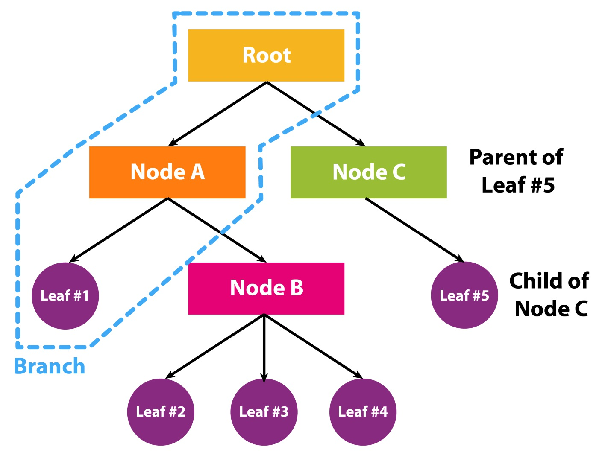

这看起来可能很复杂，但实际上并不复杂。随着我们继续讨论行为树，事情会变得有趣起来。

#### 行为树的构成

如果查看官方文档，您会发现有五种类型的节点\(任务、装饰器、服务、组合和根\)可供使用，这取决于您试图创建的行为类型\(以及随后AI在世界上应该如何操作\)。但是，我想对此进行重新表述，以使其更易于理解，并希望更实用。

除了根节点之外，唯一的节点类型\(不是叶节点\)是复合节点。叶子被称为任务。装饰器和服务是复合节点或任务叶的附加组件。虽然虚幻让你保留复合节点作为一个叶子，您不应该这样做，因为这意味着您可以删除该节点，而行为树仍将以相同的方式工作。下面是一个树的例子，展示了所有不同类型的节点\(实际上，我们将在本书后面构建这个行为树\):

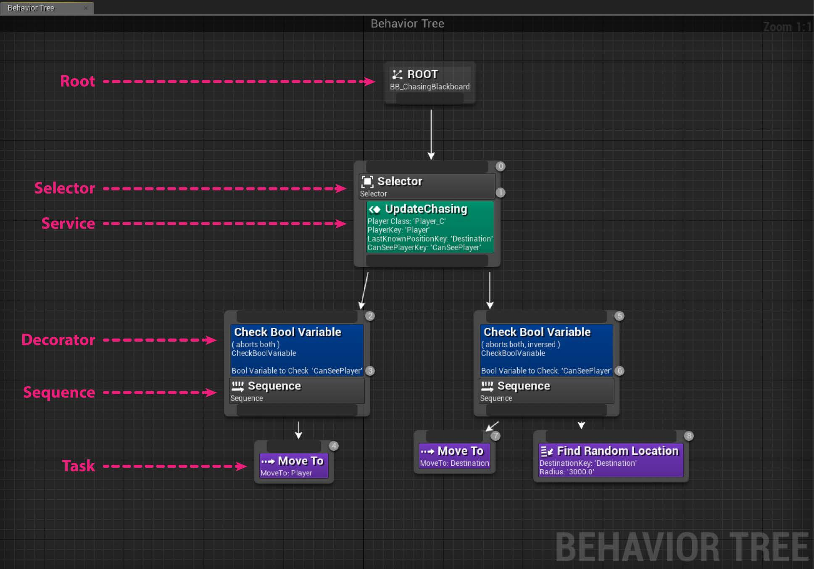

当执行树时，您需要从根节点开始，沿着树向下，从左到右读取节点。您以特定的方式遍历所有不同的分支\(组合节点\)\(我们稍后将看到这一点\)，直到到达一个叶节点，这是一个任务。在这种情况下，人工智能执行这个操作的任务。需要注意的是，任务可能会失败，例如，如果AI不能完成它。任务可能失败将有助于理解复合节点是如何工作的。毕竟，决策过程只是选择执行哪个任务以更好的方式实现目标\(例如杀死玩家\)。因此，基于哪个任务执行失败\(或者，正如我们将看到的，装饰器可能导致任务或整个分支失败\)，组合节点将确定树中的下一个任务。

此外，在创建行为树时，可以选择每个节点，并且可以在详情面板中找到一些调整节点/叶子行为的设置。此外，由于顺序很重要，行为树中的节点都有数字\(在右上角\)来帮助您理解节点的顺序\(尽管它总是从上到下、从左到右\)。下面的截图显示了你可以在哪里找到这些数字:

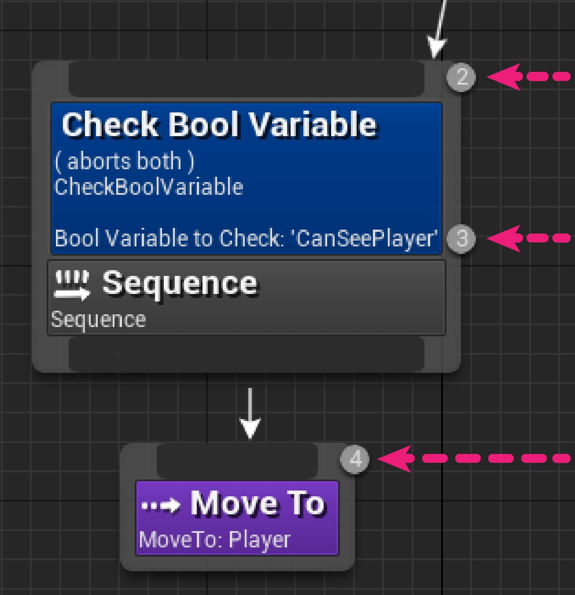

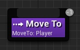

让我们详细查看这些组件，并特别注意组合节点。

**根节点**

关于根节点没有太多要说的。树需要从某处开始，所以根节点就是树开始执行的地方。它是这样的:

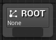

请注意，根节点只能有一个子节点，并且必须是复合节点。不能将任何装饰器或服务附加到根。如果您选择根节点，它没有任何属性，但您将能够分配黑板\(我们将在本章后面讲到\)，如下图所示:

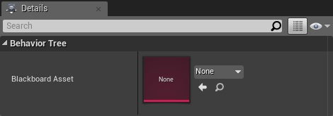

**任务**

当我们想到一棵树的时候，我们经常会想象一个有树枝的大树干，而那些树枝上就是树叶。在UE4的上下文中，这些“叶子”就是我们所说的“任务”。这些节点执行各种操作，例如移动AI，并且可以将装饰器或服务节点附加到这些节点上。但是，它们没有输出，这意味着它们在决策过程本身中不发挥作用，这完全留给组合节点。相反，它们定义了在需要执行任务时AI应该做什么。

请注意，如果您愿意，任务很复杂。它们可以简单到等待一段时间，也可以复杂到在射击玩家时解决一个谜题。大型任务难于调试和维护，而小型任务会使行为树很容易变得过于拥挤和庞大。作为一个好的AI开发者，您应该尝试在任务的大小之间找到一个平衡，并以一种可以在树的不同部分\(甚至在其他树中\)重用它们的方式编写它们。

任务可以失败\(报告失败\)，也可以成功\(报告成功\)，直到报告了这两个结果中的一个，它才会停止执行。组合节点负责处理这个结果并决定下一步要做什么。 因此，一个任务可能需要执行多个帧，但是只有在报告失败或成功时才会结束。当你学习到第六章的时候，请记住这一点扩展行为树，在这里你可以创建自己的任务。

任务可以有参数\(一旦选择了任务，就可以在详情面板中设置参数\)，通常它们是固定的值或在黑板上关键值的引用\(本章后面的黑板上会有更多内容\)。

在行为树编辑器中，任务显示为紫色框。在下面的屏幕截图中，您可以看到一些任务示例以及它们在编辑器中的样子:

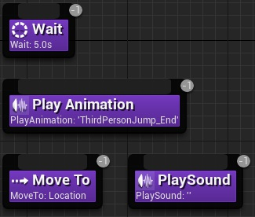

虚幻自带了一些可以使用的任务。它们是通用的，涵盖了您可能需要的基本情况。显然，它们不能特定于你的游戏，所以你需要创建自己的任务\(我们将在第6章“扩展行为树”中看到这一点\)。

以下是虚幻中的内置任务列表:

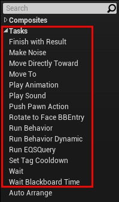

* **Finish with Result**：强制任务立即返回一个结果\(失败或成功\)。
* **Make Noise**：产生一种噪音，被感知系统使用\(这将在第5章Agent Awareness中进行探讨\)。
* **Move Directly Toward**：类似于下面的节点，但它忽略了导航系统。
* **Move To**：将Pawn\(通过使用导航系统，我们将在第3章导航中讨论\)移动到Blackboard中指的位置\(我们将在本章后面讨论黑板\)。
* **Play Animation**：顾名思义，这个节点播放动画。然而，撇开异常\(这也是这个节点存在的原因\)不谈，最好将动画逻辑和行为逻辑分开。因此，尽量不要使用这个节点，而是改进您的动画蓝图。
* **Play Sound**：顾名思义，这个节点播放声音。
* **Push Pawn Action**：Pawn的表现\(不幸的是，我们不会在这本书中涵盖他们\)。
* **Rotate to face BBEntry**：旋转AIPawn面对一个特定的值，这个key已经在黑板里定义了\(我们将在本章后面看到黑板是什么\)。
* **FRun Behavior**：运行另一个行为树作为一个完整的子树。因此，可以嵌套行为树来创建和组合非常复杂的行为。
* **Run Behavior Dynamic**：与前面的节点类似，但是可以在运行时更改要执行的\(子\)行为树。
* **Run EQSQuery**：执行一个EQS查询\(我们将在第4章环境查询系统中看到它们是什么\)，并将结果存储在黑板上。
* **Set Tag Cooldown**：为特定的Cooldown节点设置计时器\(通过使用标记\)\(该节点是一个装饰器，我们将在本章后面介绍\)。
* **Wait**：在特定的时间内停止行为。可以指定随机值，使每次等待的时间量不同。
* **Wait Blackboard Time**：与前面的节点类似，但是时间量是从黑板中检索出来的\(本章后面将详细介绍黑板\)。

现在我们已经了解了任务节点的工作方式，让我们研究一下组合节点，它们根据任务是否返回失败或成功来做出决策。

**组合**

组合节点是虚幻中行为树决策能力的核心，了解它们是如何工作是关键的。

有三种组合节点:选择器、序列和简单平行的。最后一个是最近添加的，您将发现通过使用选择器和序列的组合，您将能够覆盖大多数情况。它们是这样工作的:

**Selector**:这类节点将尝试查找要执行的子节点之一，这意味着它将尝试查找要执行的分支\(即作为子节点附加的另一个组合节点\)或任务\(另一个子节点，但它是一个叶子\)。因此，选择器从最左边的子节点开始并尝试执行它。如果它失败\(要么任务执行失败，要么整个分支失败\)，那么它将尝试最左边的第二个分支，依此类推。如果其中一个子元素返回Success，这意味着任务已经完成或整个分支已经完成，则选择器向父选择器报告成功，并停止执行其他子选择器。另一方面，如果选择器的所有子元素都报告失败，那么选择器也会向父元素报告失败。在下面的截图中，您可以看到选择器节点:


**Sequence**:这种节点的工作方式有点像选择器的反面。要向父序列报告成功，序列的所有子序列都必须报告成功。这意味着序列将开始执行最左边的子节点。如果它是成功的，那么它就会在最左边的第二个位置继续，以此类推，如果它也是成功的。如果直到最右边的所有子元素都是成功的，那么序列就向它的父元素报告成功。否则，如果只有一个子代失败，则序列将停止执行它的子序列，并向父序列报告失败。在下面的截图中，你可以看到序列节点的样子:

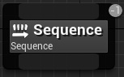

**Simple Parallel**:这是一种特殊的组合节点，用于特定的情况。事实上，它只能有两个孩子。最左边的孩子必须是任务，而最右边的子元素既可以是任务，也可以是组合\(从而生成子树\)。简单的并行开始并行地执行它的两个子进程，尽管最左边的被认为是主进程。如果主节点失败，它将报告失败，但是如果主节点成功，它将报告成功。根据其设置，简单的并行一旦完成了主任务的执行，就可以等待到子树的执行结束，或者直接向父树报告主树的成功或失败，并停止执行子树。在下面的屏幕截图中，您可以看到简单的并行节点是什么样子的。请注意，可以只拖动两个子元素，其中最左边的元素必须是一个任务\(紫色的方块是可拖动的区域\):

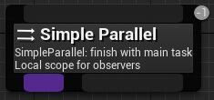

通过这种方式，组合节点可以根据其子节点的报告\(失败或成功\)“决定”执行哪些任务，并将组合节点的报告返回给父节点\(失败或成功\)。即使根的独生子女\(这是一个 组合节点\)向根报告成功，然后成功执行树。一个好的行为树设计应该总是考虑到成功。

**装饰器**

**Decorator**节点\(也称为条件\)附加到复合节点或任务节点。Decorator节点决定是否可以执行行为树中的分支，甚至是单个节点。本质上，它们是一种条件;它们检查是否应该发生某些事情。换句话说，Decorator可以检查是否值得在该分支上继续，并且可以根据一个条件报告一个预防性错误，如果我们确信任务\(或子树\)将失败。这将避免Decorator试图执行不可能完成的任务\(或子树\)\(由于任何原因:缺少信息，目标不再相关，等等\)。

通常，装饰器节点可以充当父节点和子树的其余部分之间的门。因此，decorator可以循环子树直到满足某个条件，或者直到特定计时器过期才在子树中执行，甚至更改子树的返回结果。

举一个\(简单的\)例子，假设有一个子树致力于杀死玩家\(它将做出决定以便代理尝试杀死玩家\)。检查玩家是否在游戏范围内\(而不是来自地图的另一边\)，或者甚至是玩家是否还活着，都可能给我们带来预防性失败，而我们甚至无需执行该子树。因此，树可以继续处理树的其他事件或树的其他部分，例如，在另一个子树中，它将负责漫游行为。

装饰器可以有参数\(您可以在详细信息中设置这些参数\)通常它们要么是固定的值，要么是黑板key引用\(在本章后面的黑板上有更多介绍\)。

几乎每个装饰器的参数中都有一个复选框，允许您反转条件\(因此，您将有更多的自由，您可以在树的两个不同部分上使用相同的装饰器来执行不同的条件\)。

下面的屏幕截图显示了如何将decorator附加到复合节点。注意，每个节点可以有多个装饰器:

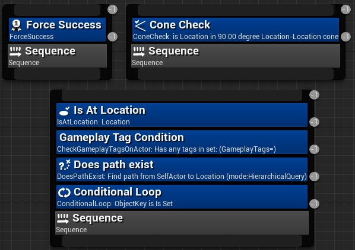

和Tasks一样，虚幻也有一些内置的装饰器可供使用。它们是通用的，涵盖了你可能需要的基本情况，但显然，它们不能为你的游戏或应用程序专门设置，所以你需要创建自己的decorator\(我们将在第6章中详细介绍，扩展行为树\)。

以下是虚幻的内置任务列表:

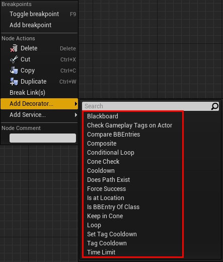

* **Blackboard**：检查黑板上是否设置了特定的key。
* **Check Gameplay Tags on Actor**：顾名思义，它检查Actor是否有一个特定的游戏标签，指定黑板上key。
* **Compare BBEntries**：比较两个黑板值，并检查它们是否相等。
* **Composite**：这允许您使用布尔逻辑一次组成不同的decorator。放置了这个装饰器之后，可以通过双击打开它的编辑器。从那里，您将能够构建一个带有布尔操作符和其他装饰器的图。
* **Conditional Loop**：只要条件满足\(是否黑板键的设置或未设置\)，它将继续在子树中循环。
* **Cone Check**：这检查一个点\(通常是另一个参与者\)是否在一个圆锥内，从另一个点\(通常是AI agent\)开始;锥角和方向是可以改变的。一个使用它的例子是，如果你想检查玩家是否在敌人面前，你可以使用这个代码来确定这个条件。
* **Cooldown**：一旦执行从包含它的分支中退出这个Decorator将启动一个Cooldown计时器，并且这个Decorator不允许再次执行，直到这个计时器过期\(它会立即报告失败\)。使用此节点是为了避免过于频繁地重复相同的子树。
* **Does Path Exist**：它使用了导航系统\(在第三章中详细介绍，导航\)来确定\(并检查\)某个特定点的路径是否存在。
* **Force Success**：顾名思义，它强制子树成功，不管下面报告的是失败\(还是成功\)。这对于在序列中创建可选分支非常有用。
* **Is at Location**：顾名思义，它检查兵是否\(靠近或\)在一个特定的位置\(可选，使用导航系统\)。
* **Is BBEntry of Class**：顾名思义，它检查特定的黑板入口是一个特定的类。这是有用的，当黑板项的类型为Object，您需要检查引用是否在Blackboard是一个特定的类\(或继承自一个类\)。
* **Keep in Cone**：与锥检查类似，这个装饰器\(连续地\)检查观察者是否在锥内。
* **Loop**：顾名思义，它在子树中循环特定次数\(甚至无限次;在这种情况下，需要其他东西来停止子树的行为，例如另一个装饰器\)。
* **Set Tag Cooldown**：与它的同名任务类似，当这个装饰器变得相关时\(或者如果您将它想象成一个门，当它被遍历时\)，它将更改特定标记的Cooldown计时器\(参见下面的节点\)。
* **Tag Cooldown**：这与Cooldown节点相同，但它有一个与标记关联的计时器。因此，这个计时器可以通过“Set标记”来更改任务和由“设置Cooldown标签”装饰器。
* **Time Limit**：顾名思义，它为子树提供了时间限制。否则，这个Decorator将停止执行并返回一个失败。

现在我们已经了解了装饰器节点是如何工作的，让我们研究行为树的最后一种类型的节点——服务节点，它将不断地实时更新和提供信息。

**服务**

**Service**节点附加到复合节点或任务节点，并将在其分支被执行时执行。这意味着，只要附加了节点下面的节点，不管执行多少级别的父子级，服务也将运行。下面的屏幕截图将帮助您可视化：

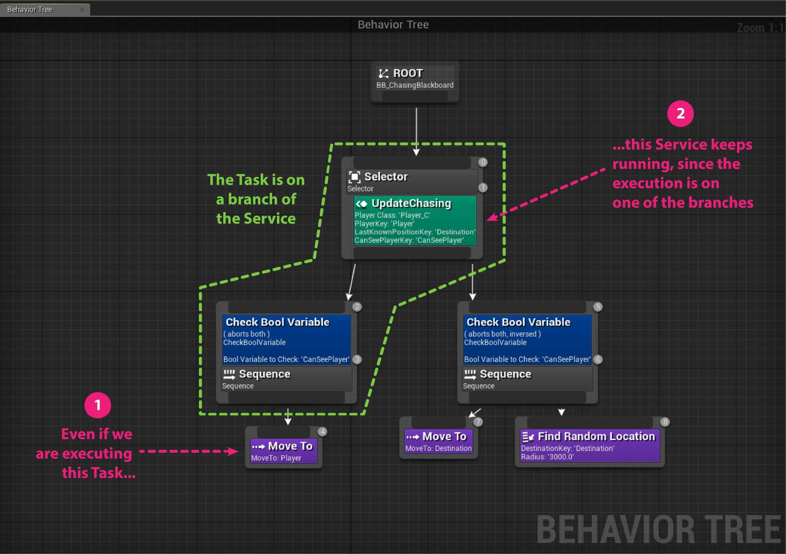

这意味着服务节点是行为树执行的眼睛。实际上，它们是连续运行的\(如果子树是活动的\)，并且可以实时执行检查和/或更新黑板\(稍后见\)值。

服务节点实际上是特定于行为树应用程序的，因此只有两个默认节点。它们的使用示例可能是向子树提供/更新信息。例如，想象一个场景，一个子树\(敌人\)正试图杀死玩家。然而，即使当玩家没有反击敌人时，追求这个目标也是愚蠢的\(好吧，这取决于敌人的类型，巨魔可能不是那么聪明\)。因此，当子树试图杀死玩家时，子树需要找到掩体来减少敌人受到的伤害。然而，敌人可能会在地图上移动，或者玩家可能会破坏我们AI隐藏的掩体。因此，子树需要关于最近和最安全的掩蔽点的位置的信息，这仍然是在玩家的范围内\(一个EQS查询可以计算出来\)。服务可以实时更新这些信息，这样当子树需要使用有关覆盖的数据时，它们就准备好了。在这个特殊的例子中，寻找掩护，运行一个服务上的环境查询是处理任务的一种动态方式\(我们将 在第四章环境查询系统中讨论这个主题\)。否则,服务可以检查由设计者放置在地图上的特定点，并评估哪个点对其给定的操作是最好的。

正如您所看到的，服务节点可能非常强大，但是它们也特定于您使用它们的应用程序。因此，它们实际上依赖于你为游戏编写的AI。

下面的屏幕截图显示了几个服务示例。请注意，服务可以与装饰器一起使用，一个复合节点可以有多个服务:

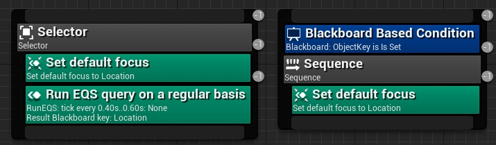

只有两个可用的默认服务\(因为你需要为你的游戏编程，我们将在第六章扩展行为树中做\)如下截图所示:

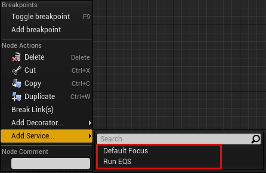

* **Set Default Focus**:当此节点激活时，将自动设置AI控制器的默认焦点。
* **Run EQS**\(Query on a regular basis\):顾名思义，它运行一个环境查询\(请参阅第4章，环境查询系统，了解更多信息\)，定期检查特定的地点或角色。这就是我们在为敌人寻找掩护的例子中所需要的服务。

现在，我们已经了解了组成行为树的不同类型的节点。现在，是时候探索黑板了!

## 黑板和它们与行为树的交互

把行为树看作是大脑，我们可以把黑板看作它的内存——更具体地说，是人工智能的内存。黑板存储\(和设置\)行为树要使用的键值。

它们被称为黑板是因为，在教室里黑板是一个传达大量信息的地方，但大部分信息在学生之间共享;发给学生的单个笔记是私人的。您可以将学生想象成行为树的不同任务\(和节点\)黑板作为共享数据的地方。

黑板很容易理解，因为它们只比数据结构复杂一点。唯一的区别在于将行为树分配给特定黑板，黑板由树的每个节点共享。因此，每个节点都可以读和/或写回黑板。

它就像一个字典\(数据结构\)，其中一个键对应于一个特定的值类型\(例如一个向量，一个浮点数，一个演员，等等，甚至另一个黑板key\)。因此，通过使用或调用key，可以写入或读取相关的值。

黑板的另一个很酷的特性是它们可以通过继承进行扩展。这意味着另一个黑板可以是父类，而子类将继承父类的所有键值，以及子类本身包含的一些特定的键值。

现在我们已经介绍了理论，让我们看看如何创建行为树，然后让它跑起来。为此，我们首先创建一个新项目。

## 创建AI工程

从现在开始，我们将通过创建一个项目来开始我们的工作，并对我们所学到的行为树有一个大致的了解。在本节中，我们将创建一个简单的树，但是随着我们在接下来的章节中对其他主题了解的更多，我们将迭代行为树。因此，这将为您提供一个更好的理解工具，需要创建awesome行为树。然后，在第8章，设计行为树-第一部分，第9章，设计行为树-第二部分和第10章，设计行为树-第三部分中，我们将专注于如何从头开始创建并设计一个追逐玩家的行为树，这将给你一个实用的方法行为树。

因此，为了能够测试我们将在本书中探索的技术，我们需要创建一个项目。通过这样做，您将能够遵循贯穿全书的实践方面。

您可以从模板创建新项目。第三人称模板特别好用。事实上，它已经在里面设置了一个字Character，这很容易被AI所拥有。这意味着你不必太担心与AI无关的细节，比如动画。你可以选择蓝图版本或C++版本。

我将解释这两篇文章中涉及贯穿始终的Blueprint和C++概念，但请注意，如果用C++编程会更好。因此，我选择第三人称模板的C++版本，尽管这个初始选择对我们影响不大\(我们是在编程AI，而不是作为玩家或关注游戏玩法\)。

最后，我将我的项目命名为UnrealAIBook，如下面的截图所示。同样，您可以在以下链接中找到项目文件:[http://hog.red/AIBook2019ProjectFiles](http://hog.red/AIBook2019ProjectFiles) \(链接区分大小写\):


## 从AI Controllers开始我们的行为树

现在我们已经了解了行为树是什么以及它们由什么组成的，接下来让我们创建自己的行为树。回想上一章，负责拥有和控制Pawn的是AI Controller。因此,我们的行为树应该运行在AI Controller上。

我们有两种方法。第一个是使用蓝图。通常，即使您是一名程序员，也最好使用蓝图，因为逻辑很简单，控制器也很简单。另一方面，如果您是一个C++爱好者，并且希望尽可能多地使用它，即使是用于小任务，请不用担心——我将再次创建相同的逻辑，但这次是在C++中。在任何情况下，行为树资产都应该在编辑器中创建和修改。最终编程的节点与默认可用的节点不同\(我们将在本书后面看到这一点\)，但树本身总是在编辑器中创建的。

### 创建行为树和黑板

首先，我们需要创建四个蓝图类:AI Controller，Character，行为树和黑板。稍后我们将介绍AI Controller。如果您选择了第三人称模板，那么您应该已经拥有了Character。因此，您只需要创建一个行为树和一个黑板上。

在内容浏览器中，创建一个新文件夹并将其命名为Chapter2。这将有助于保持事情井井有条。然后，创建一个子文件夹并命名为AI。因此，我们可以保持我们的项目整洁，并确保我们不会将本章的项目与我们可能创建的其他非AI相关的类和/或对象混淆。我们将把为AI创建的所有资产放在这个文件夹中。

#### 创建黑板

现在，我们需要添加一个黑板，它应该总是在AI文件夹中。为此，转到内容浏览器并选择Add New &gt; Artificial Intelligence &gt; Blackboard。

现在，我们将黑板命名为BB_MyFirstBlackboard。在这里，我使用命名约定，以BB_作为所有黑板的前缀。除非您有特殊的理由不遵循此命名约定，否则请使用它。通过这样做，您将与本书的其余部分同步。

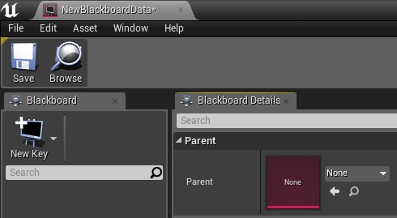

#### 创建行为树

让我们通过进入内容浏览器并选择add来添加行为树Add New &gt; Artificial Intelligence &gt; Behavior Tree，如下图截图:

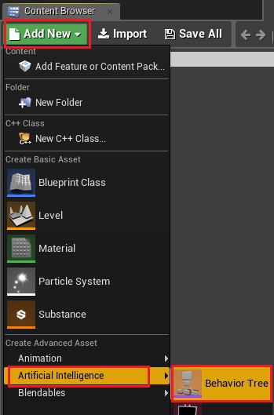

现在，我们将命名行为树为BT_MyFirstBehaviorTree。同样，在这里，我使用了一个特定的命名约定，以BT_作为所有行为树资产的前缀。同样，请遵循命名约定，除非您有特殊的理由不这样做。

当您打开行为树窗口时，您将看到一个根节点,如下:


根是行为树的执行开始的地方\(从上到下，从左到右\)。根本身只有一个引用，即黑板，所以它不能和其他东西连接。它是树的顶端，所有后续节点都在它下面。

如果从根节点拖动，就可以添加复合节点：

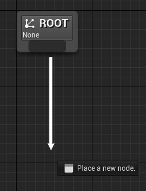

为此，行为树编辑器非常直观。可以继续从节点中拖出以添加复合或任务节点。添加一个装饰器或服务，您可以右键单击节点并选择“Add Decorator…”或“Add”服务……”，分别如下图所示:

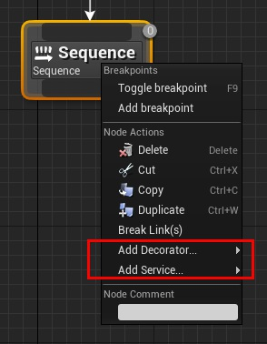

最后，如果单击一个节点，则可以在详细信息面板看到 具体参数\(下面的截图显示了一个例子\):

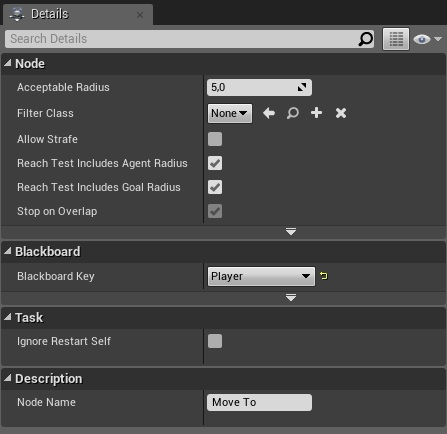

### 在AI Controller中执行行为树

下一步是从AI Controller执行行为树。通常，这是一项简单的任务，可以在蓝图中实现\(在蓝图中可以直接引用特定的行为树\)。即使我们有一个复杂的C++ AI Controller，我们也可以在蓝图中扩展AI Controller并从中执行行为树蓝图。在任何情况下,如果硬引用不工作\(如您使用C++或因为你想拥有更大的灵活性\),然后你就可以在行为树中存储Character/Pawn,这需要执行特定行为树,当AI Controller拥有Pawn时进行检索。

让我们探讨如何在蓝图中实现这两个功能\(我们将引用行为树中的一个变量，在其中我们可以决定默认值\)和\(我们将在Character中存储行为树\)。

#### 蓝图中的AI Controller

我们可以通过点击Add New \| BlueprintClass \| AI Controller。你必须点击所有的类并搜索AI Controller来访问它。你可以在下面的截图中看到一个例子:

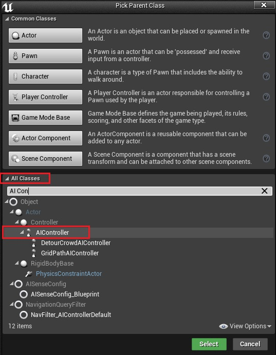

现在，命名我们的AI Controller为BP\_MyFirstAIController。双击它以打开蓝图编辑器。

首先，我们需要创建一个变量，以便存储行为树。虽然没有必要保持对行为树的引用，但是这样做是一个好的实践。要创建一个变量，我们需要在我的蓝图面板中按下变量标签旁边的+ Variable按钮，如下图所示\(记住，你的光标需要在变量标签上才能显示按钮\):

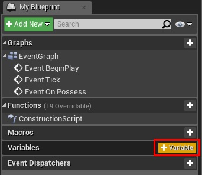

然后，您需要选择行为树变量类型并给它一个名称，比如BehaviorTreeReference。你的变量应该是这样的:

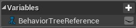

然后，在详细面板中，我们将设置默认值\(记住，设置默认值需要对蓝图进行编译\):

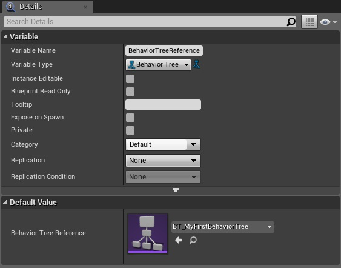

然后，我们需要重写On Possess函数，如下图所示:

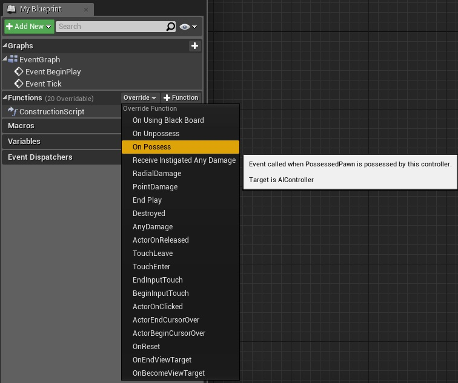

最后，在AI Controller的事件Event On Possess 中，我们需要开始运行/执行行为树。我们可以使用以下简单的节点来实现这一点，名为Run Behavior Tree:

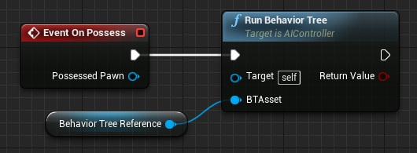

因此，你的AI Controller将能够执行存储在BehaviorTreeReference中的行为树。

#### C++中的AI Controller

如果您决定用C++创建这个简单的AI Controller，让我们开始吧。我假设你的虚幻编辑器已经设置在C++工作\(例如，你有安装了Visual Studio，调试的符号等等…这里有一个参考链接，你可以开始:[https://docs.unrealengine.com/en-us/Programming/QuickStart\)，同时你有基本的如何在Unreal使用C++的知识。下面是命名约定的链接，以便您理解为什么一些类在代码中使用字母作为前缀:https://docs.unrealengine.com/en-us/Programming/Development/CodingStandard。](https://docs.unrealengine.com/en-us/Programming/QuickStart%29，同时你有基本的如何在Unreal使用C++的知识。下面是命名约定的链接，以便您理解为什么一些类在代码中使用字母作为前缀:https://docs.unrealengine.com/en-us/Programming/Development/CodingStandard。)

在开始之前，请记住，为了在C++中处理AI，需要在.cs文件中添加公共依赖项\(在本例中为UnrealAIBook.cs\)，并添加GameplayTasks和AIModule作为公共依赖，如下代码所示:

```text
PublicDependencyModuleNames.AddRange(new string[] { "Core", "CoreUObject", "Engine", "InputCore", "HeadMountedDisplay", "GameplayTasks", "AIModule" });
```

这将确保您的代码在编译时没有问题。

让我们创建一个新的C++类，如下面的截图所示:


该类需要从AI Controller类继承。您可能需要勾选右上角的“显示所有类”复选框，然后使用搜索栏，如下面的截图所示:

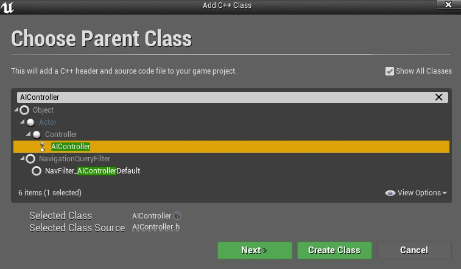

单击Next并将类命名为MyFirstAIController。此外，我建议你保持我们项目的整洁。因此，单击Choose Folder按钮。虚幻将提示你去你的系统文件夹资源管理器。在这里，创建一个名为AI的子文件夹。选择这个文件夹作为存储我们将要创建的代码段的地方。在你点击创建之前，对话框应该是这样的:

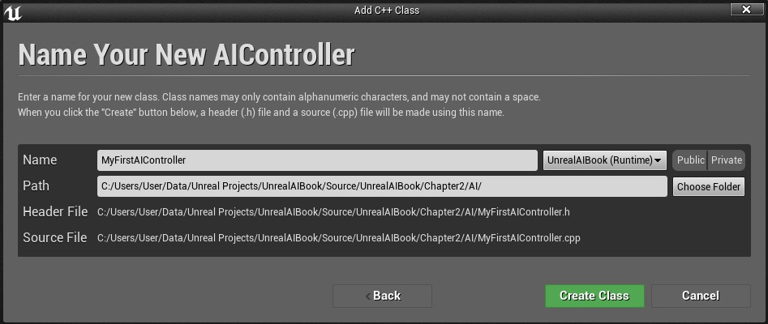

现在，单击Create并等待编辑器加载。你可能会看到这样的东西:

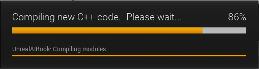

与蓝图版本相比，代码的结构将略有不同。事实上，我们不能直接从AI Controller类中分配行为树\(主要是因为很难直接引用它\);相反，我们需要从Character上获取。正如我前面提到的，当您使用蓝图时，这也是一个很好的方法，但是由于我们选择了一个C++项目，我们应该看看一些代码。在Visual Studio中打开UnrealAIBookCharacter.h文件，在公共变量下面，添加以下代码行:

```cpp
//** Behavior Tree for an AI Controller (Added in Chapter 2)
UPROPERTY(EditAnywhere, BlueprintReadWrite, category=AI)
UBehaviorTree* BehaviorTree;
```

对于那些还不熟悉的人，这里有一个更大的代码块，这样你就可以理解把前面的代码放在类的哪里:

```cpp
public:
     AUnrealAIBookCharacter();
    /** Base turn rate, in deg/sec. Other scaling may affect final turn rate. */
     UPROPERTY(VisibleAnywhere, BlueprintReadOnly, Category=Camera)
     float BaseTurnRate;
    /** Base look up/down rate, in deg/sec. Other scaling may affect final rate. */
     UPROPERTY(VisibleAnywhere, BlueprintReadOnly, Category=Camera)
     float BaseLookUpRate;
    //** Behavior Tree for an AI Controller (Added in Chapter 2)
     UPROPERTY(EditAnywhere, BlueprintReadWrite, category=AI)
     UBehaviorTree* BehaviorTree;
```

此外，为了编译前面的代码，我们还必须在类的顶部包括下面的语句，就在.generated上面:

```cpp
#include "CoreMinimal.h"
#include "GameFramework/Character.h"
#include "BehaviorTree/BehaviorTree.h"
#include "UnrealAIBookCharacter.generated.h"
```

关闭Character类，因为我们已经完成了它。因此，每当我们在世界中放置一个Character的实例时，我们就能够从细节面板中指定一个行为树，如下面的截图所示:

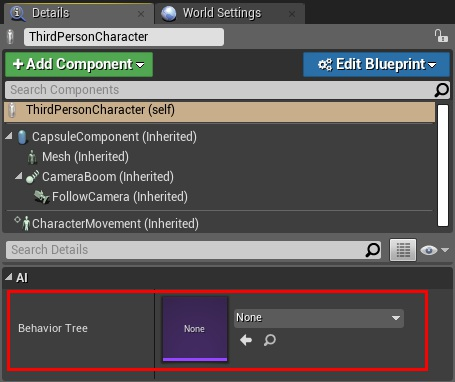

让我们打开新创建的AI Controller的头文件\(.h\)\(如果你使用VS作为IDE，它应该已经在Visual Studio中打开了\)。特别是，我们需要重写AI Controller类的一个函数。我们要覆盖的函数叫做Possess\(\)，它允许我们在AI中运行一些代码操控者拥有一个新的Pawn\(也就是说，当它控制角色时，这个角色是一个Pawn\)。添加以下粗体代码\(在受保护的可见性内\):

```cpp
UCLASS()
class UNREALAIBOOK_API AMyFirstAIController : public AAIController
{
     GENERATED_BODY()

protected:
  //** override the OnPossess function to run the behavior tree.
  void OnPossess(APawn* InPawn) override;
};
```

接下来，打开实现\(.cpp\)文件。再一次，使用行为树，我们必须包括行为树和UnrealAIBookCharacter类:

```cpp
#include "MyFirstAIController.h"
#include "UnrealAIBookCharacter.h"
#include "BehaviorTree/BehaviorTree.h"
```

接下来，我们需要为 Possess\(\)函数写一个功能。我们需要检查Pawn是否真的是一个UnrealAIBookCharacter，如果是，我们检索行为树并运行它。当然，这是一个if语句，以避免我们的指针为nullptr:

```cpp
void AMyFirstAIController::OnPossess(APawn* InPawn)
{
  Super::OnPossess(InPawn);
  AUnrealAIBookCharacter* Character = Cast<AUnrealAIBookCharacter>(InPawn);
  if (Character != nullptr)
  {
    UBehaviorTree* BehaviorTree = Character->BehaviorTree;
    if (BehaviorTree != nullptr) {
      RunBehaviorTree(BehaviorTree);
    }
  }
}
```

一旦我们编译了我们的项目，我们将能够使用这个控制器。在关卡中选择我们的AI character\(如果你没有它，你可以创建一个\)，这一次，在细节面板中，我们可以设置C++控制器，如下所示:

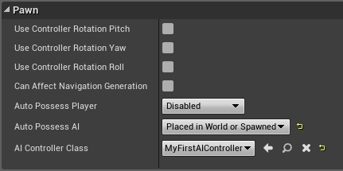

另外，不要忘记在细节面板中设置行为树:

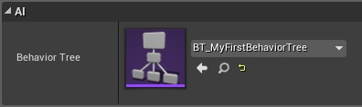

因此，一旦游戏开始，敌人将开始执行行为树。目前，树是空的，但这提供了我们需要的结构，以便我们可以开始使用行为树。在接下来的章节中，我们将更详细地探索行为树，特别是在第8、9和第8章10、在那里我们将看到一个更实际的方法来设计和建造行为树。

## 总结

在本章中，我们已经介绍了什么是行为树以及它们所包含的一些内容，包括任务、装饰器和服务。接下来，我们学习了黑板以及如何将它们与行为树集成。然后，我们创建了一个行为树，并学习了如何让它从一个AI控制器开始\(在蓝图和C++中\)。通过这样做，我们已经构建了为我们提供关键内容的基础，以便我们可以处理这本书的其他部分。

因此，在本书中我们会遇到更多的行为树，而你也有机会掌握它们。但在那之前，我们需要先了解一些特定的话题。一旦我们有了导航和感知的基础\(包括EQS\)，我们可以遍历行为树来理解组合节点的角色，以及装饰器和任务。此外，我们将能够创造自己的。第8、9和10章将指导您从头开始，从设计阶段到实现阶段创建行为树的过程。

但在那之前，让我们进入下一章，我们将要讨论的导航和寻路!

