# 第三章

## 导航

寻路的问题和克诺索斯的迷宫一样古老:我如何用最短的路线从A点到达B点，并避免中间的所有障碍?

许多算法已经被开发来解决寻路问题，包括那些与A\*算法相关的算法，该算法在20世纪60年代首次被引入计算机科学\(第2节\)。

寻路程序是许多游戏的典型组成，npc的任务是在游戏地图上找到最优路径，而这条路径是不断变化的。例如，通道、大门或门可以在游戏过程中改变它们的状态。

当涉及到寻路时，会有很多问题，而且对我们来说不幸的是，没有一种能够解决所有问题的方法。这是因为根据问题的类型，每个问题都有自己的解决方案。不仅如此，它还取决于你所开发的游戏类型。例如，AI角色的最终目的地是静态的建筑\(静止的\)，还是需要跳到漂浮的筏子上\(动态的\)?你还需要考虑地形——它是平坦的还是崎岖的?为了增加复杂性，我们还需要考虑是否存在障碍物，以及这些物体是否是静态的\(消防栓\)或是否可以移动\(例如盒子\)。然后，我们需要考虑实际的路径本身。例如，沿着公路跑可能更容易，但是在屋顶上跑会让你跑得更快。按照同样的思路，人工智能甚至可能没有最终目的地，也就是说，它们不必在某个特定的地方。例如，他们可能只是作为一个村庄的一部分四处游荡。然而，我只强调了几个与寻路相关的问题和注意事项。在使用寻路的不同情况下，您可能会遇到其他问题。记住要有耐心，考虑我在这里提到的所有变量，以及其他与你的情况相关的变量。对我们来说幸运的是，Unreal已经包含了一个可以能够在大多数情况下使用的导航系统。因此，我们不需要从头开始重新实现所有东西。本章的主要目标是确保您了解如何使用它，并确保您对如何扩展它有一些概念。

在本章中，我们将涵盖以下主题:

* 对**导航系统**有什么期待呢
* **虚幻的导航系统**是如何工作的
* 如何在关卡中**生成导航盒**并应用它
* 使用以下方法**修改导航盒**：
  * **Navigation Areas**，修改导航盒的部分权重
  * **Navigation Links**，连接两个部分的导航盒
  * **Navigation Filters**，在导航系统上执行特定查询时对导航网格执行轻微更改

让我们开始吧！

### 对**导航系统**有什么期待呢

首先，在我们探索虚幻导航系统之前，定义一下我们对通用导航系统的期望是很有用的。导航系统需要具备以下条件:

* 它需要确定地图上的两个通用点之间是否存在一个路径\(执行查询的代理可以遍历该路径\)
* 如果存在这样的路径，则返回对代理最方便的路径\(通常是最短的\)

然而，在寻找最佳路径的过程中，有很多方面需要考虑。一个好的导航系统不仅要考虑这些问题，还要在相对较短的时间内执行查询。其中一些方面如下:

* 执行查询的AI代理能够通过地图的特定部分吗?例如，可能有一个湖，而AI角色可能会也可能不会游泳。同样地，代理是否可以蹲下并进入通风隧道？
* AI代理可能想要避免\(或偏好\)某些路径，这些路径不一定是最短的。例如，如果一栋建筑着火了，代理应该尽量避免这种情况，否则就会有被烧毁的危险。再举个例子，假设有两条路:一条是被敌人火力覆盖的，但是很长;另一条是短的，但是暴露在敌人火力之下;应该选择哪一个呢?尽管这可能是决策过程的一部分，一些启发式算法可以在寻路的层次上实现，并且导航系统应该支持它们。
* 地图可能是动态的，这意味着在游戏过程中障碍、物体、道路、悬崖等等都会发生变化。导航系统能够实时处理这些变化，并纠正生成的路径吗?

现在，我们来看看Unreal是如何实现所有这些功能的。

### 虚幻的导航系统

虚幻导航系统是基于一个导航网格\(简称Nav网格\)。它需要将可导航空间划分为若干区域——在本例中为多边形——为了提高效率，它们被细分为三角形。然后，为了到达某个位置，将每个三角形视为图的一个节点，如果两个三角形相邻，则将它们各自的节点连接起来。在这个图中，你可以执行寻路算法，比如使用欧几里得距离启发式的A _，或者甚至是更复杂的东西\(例如A_ 的变体或考虑不同成本的系统\)。这将在这些三角形之间产生一条路径，AI角色可以在其中行走。

为了能够使用导航系统，让我们了解设置导航系统的主要过程。在这个阶段，我们将不再关心系统底层的结构，而是关心如何使用它的所有特性。系统将完成其余的工作。同样，我们需要向导航系统提供有关地图的信息\(例如指定特定区域\)。通常情况下，你的团队中的AI程序员会处理这个任务，但如果你的团队很小，关卡设计师可能会处理这个任务。虽然没有一个具体的过程，倒不如说是一个迭代的过程，让我们探索不同的步骤-或工具，如果你喜欢-你可以在虚幻引擎中定义Nav网格。我们将在本章中详细研究它们:

* **Generation of the Navigation Mesh**：这是第一步。在你使用以下工具之前，重要的是生成一个Nav网格。这个步骤包括定义如何生成多边形、三角形、导航网格的精度，甚至是哪种代理将穿过这个特定的导航网格。
* **Navigation Mesh Modifiers**：并不是所有的Nav网格部分都是相等的，这是一个工具，用于指定Nav网格的哪些部分的行为应该不同。事实上，正如我们以前看到的，可能存在一个带有有毒气体的区域，代理希望避免这个部分，除非他们真的必须穿过它。Nav网格修改器允许你指定包含气体的区域是特殊的。但是，区域内的行为类型\(例如，此路径不应该被遍历，或者只能由具有游泳能力的代理遍历\)是在导航区域内指定的。
* **Navigation Areas**：这允许您指定特定类型的区域的行为方式，是否应该避免，等等。重要的是在执行Nav过滤以确定代理可以遍历哪些区域时。
* **Navigation Links**：这些可以连接两个不同的部分的Nav网格。假设你有一个平台。默认情况下，AI代理会找到另一种方法。如果你想到的是第三人称地图模板，那么需要从平台上下来的代理将会绕着这个区域走楼梯，而不是从平台上掉下来或跳下。导航链接允许你连接平台顶部和下方的部分导航网格。因此，AI角色可能会从平台上掉下来。然而，请注意Nav链接可以连接Nav的两个通用部分网格，从而允许寻路通过跳跃，传送等找到它的路。
* **Nav Filtering**：我们不一定要在任何场合都以同样的方式找到一条路。Nav过滤允许我们定义如何执行特定实例的路径查找的特定规则\(在特定时间调用路径查找来寻找路径\)。

让我们把这些要点分解并更详细地讨论一下：

### 生成导航网格

在Unreal中生成一个简单的导航网格非常简单。我们来看看怎么做。在Mode面板中，在Volume选项卡中，你可以找到Nav Mesh Bounds Volume，如下截图所示:进入翻译页面

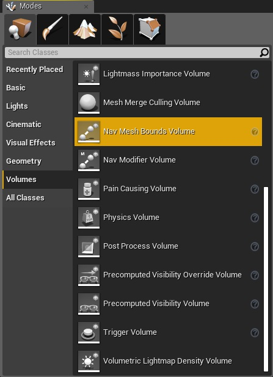

把它拖到世界上。您将注意到，相对于地图而言，体积是相当小的。在这个体积内的一切将被考虑到生成一个Nav网格。当然，一个导航网格有很多参数，但现在让我们保持默认。

如果你按下键盘上的P按钮，你就可以在视窗中看到Nav网格，如下图所示:

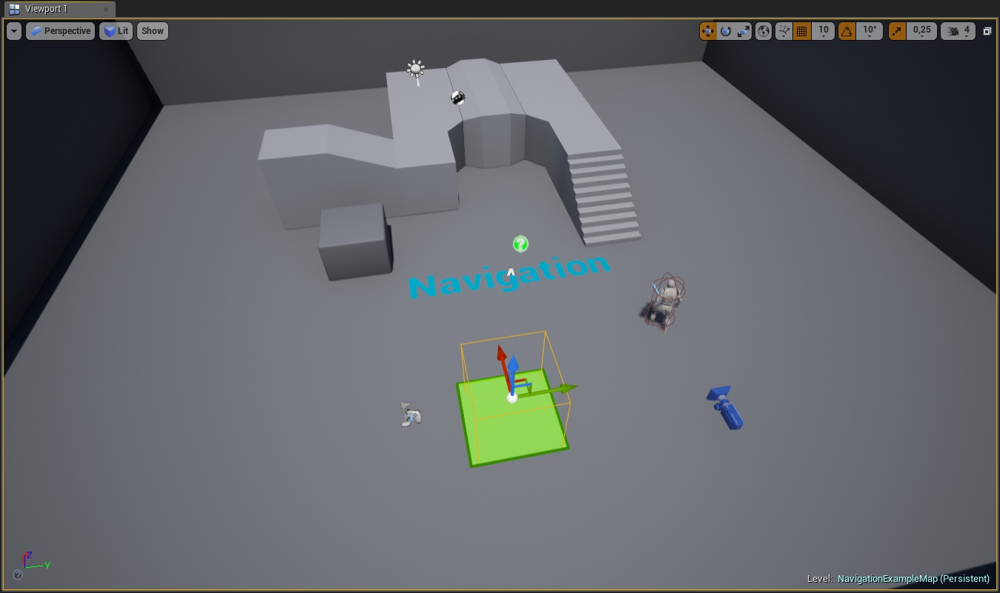

正如你所看到的，它被限制在Nav Mesh Bounds Volume范围内。让我们缩放Nav Mesh Bounds Volume，以适应我们的关卡。你的关卡应该是这样的:

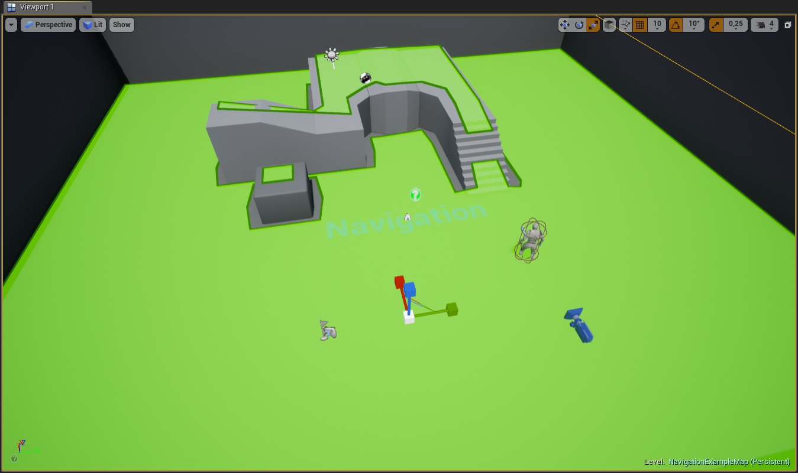

你有没有注意到，当你缩放你的volume,时，导航网格是如何自动更新的?这是因为，在虚幻中每次有影响导航网格的东西移动时，都会生成导航网格。更新时，受影响的部分\(即更新后的部分\)将变成红色，如下图所示:

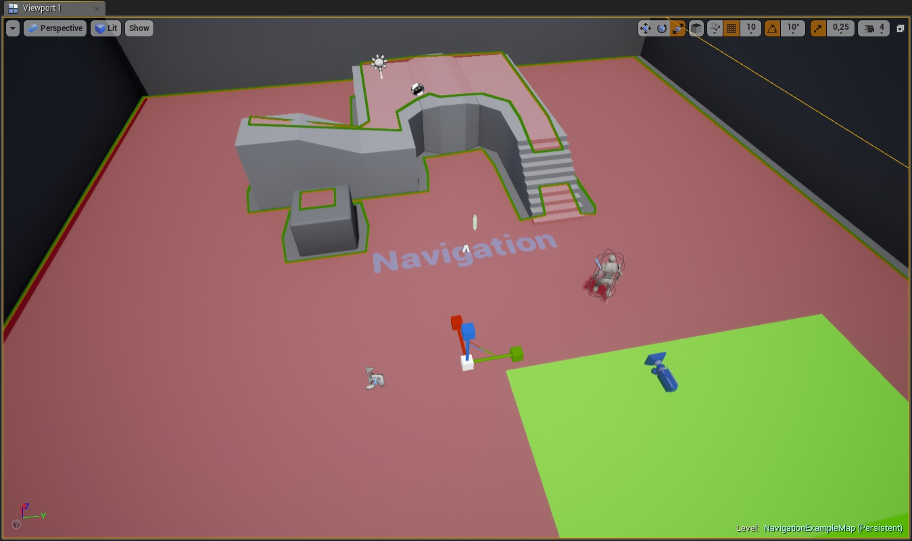

这就是如何容易生成一个导航网格。然而，为了能够掌握这个工具，我们需要学习更多关于如何细化Nav网格和它是如何被AI使用的。

### 设置导航网格的参数

如果你点击Nav Mesh Bounds Volume，你会发现没有生成Nav网格的选项。实际上，一些参数位于项目级别，而其他参数位于地图级别。

让我们选择到World Outliner，在那里你会发现场景中已经放置了默认的RecastNavMesh- Default actor，如下截图所示:

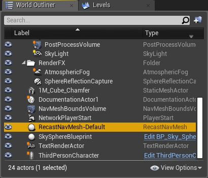

事实上，当你拖动Nav Mesh Bounds Volume，如果地图没有RecastNavMesh-Default，将自动创建一个。如果我们点击它，我们可以在细节面板中更改它的所有属性。

可以看到，有很多默认值。这些可以在项目设置\(在导航网格选项卡下\)。让我们拆分每个部分，并尝试掌握围绕它们的主要概念。

#### 显示设置

顾名思义，这些设置与我们如何可视化详细生成的导航网格有关。特别是，我们将能够看到生成的多边形，三角形，以及多边形是如何连接的。我们将在第12章中更详细地讨论这些问题，当我们谈到调试工具时:

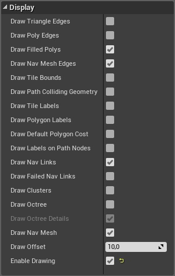

#### 生成设置

这些设置关系到Nav网格的生成。通常，一开始使用默认值是非常完美的，因此只有在知道自己在做什么时才应该接触这些值。下面的截图显示了这些设置:

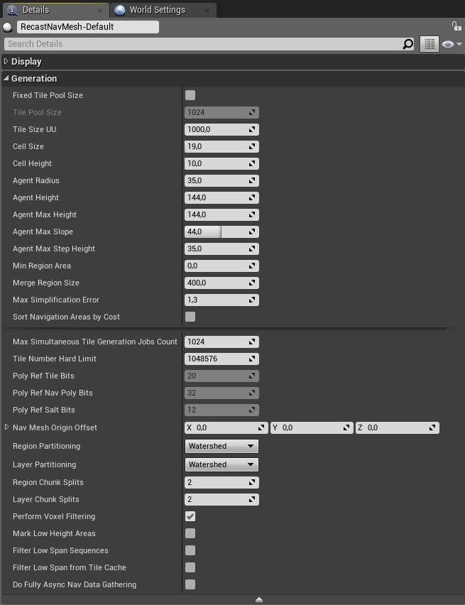

了解这些设置的最佳方法是使用它们的参数，开始前，让我们看看主要的几点:

* **Tile Size UU**：这个参数定义了生成的多边形的精细程度。更低的值意味着更精确的导航网格，有更多的多边形，但也会更慢的生成时间\(以及可能更多的内存使用\)。通过在显示设置中启用“绘制三角形边”，可以看到此参数的效果。
* **Cell Height**：这决定了产生的网格离地板有多高\(这可能导致不同的高度连接，所以要小心\)。
* Agent settings \(**Radius**, **Height**, **Max Height**, **Max Slope**, **Max Step Height**\):这些设置是特定于您的代理的，应该适当地指定。特别地，这些是一个代理应该穿过这个Nav网格的最小值。因此，导航网格将无法与小于此值的代理导航，因为导航网格仅为具有这些要求的代理生成。这些设置对于为你的代理生成一个合适的导航网非常有用，而不会浪费资源在你的代理永远无法导航的区域上。
* **Min Region Area**：这样可以消除Nav网格生成中的某些不重要而无法导航的工件。

剩下的许多设置都是关于优化的，它们可能是难以理解的，特别是对于人工智能编程新手。因此，我决定在本书中不包括这些细节。但是，一旦您对使用导航系统有了信心，您可以查看这些设置的工具提示，并对它们进行试验，以便了解它们的作用。

#### 项目设置

值得一提的是，即使我们不详细介绍它们，也可以从项目设置中更改相同的导航设置；有一个特定的选项卡，如下图所示：

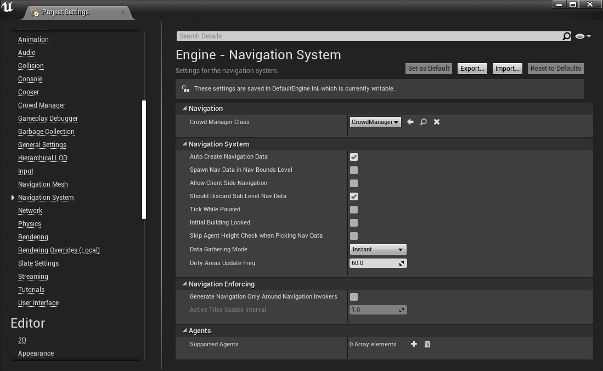

有趣的是关于代理的最后一个选项卡。在这里可以创建一个支持的代理的数组，这样不同的代理可以有不同的方式浏览Nav网格。例如，一只老鼠可能和Giant Troll有一个不同的导航网格。事实上，老鼠也可以进入小洞，而Giant Troll不能。在这里，您将能够指定所有不同类型的代理:

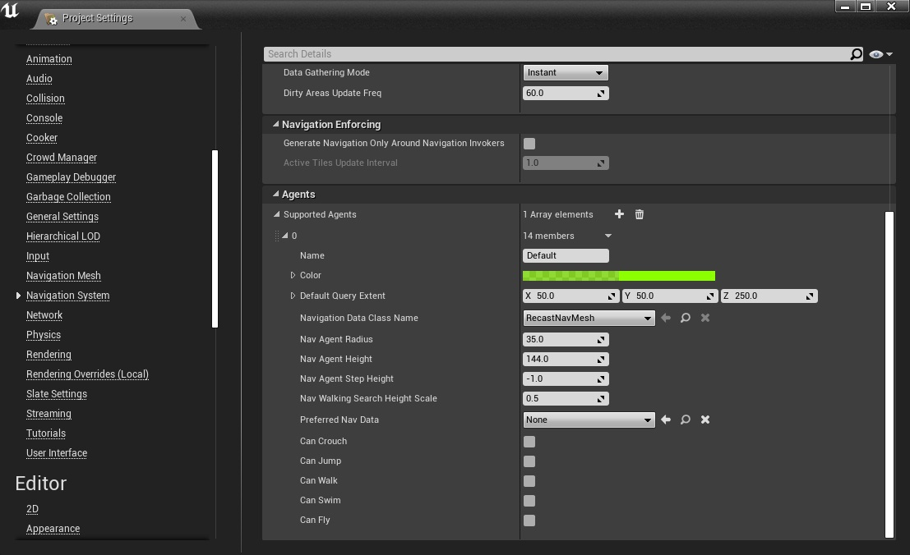

你不能直接指定你的角色将遵循哪种类型的代理，但是，基于 Character Movement组件\(或一般的Movement组件\)，一种代理会被分配给 Character/AI代理。

**在Character Movement组件中设置**

正如我们在上一节中所看到的代理的能力，它的形状等等……对导航网格的导航方式有很大影响。您将能够在Character Movement组件上找到这些设置。

但是，这个组件超出了本书的范围，我们将不会看到它。

### 修改导航网格

到目前为止，我们已经了解了如何生成一个导航网格。但是，我们想修改一下，使它更适合我们的需要。正如我们之前提到的，可能会有不同的区域需要花费很大的代价才能穿过，或者可能会有一个在导航网的两个点之间的连接，而它们是分开的。

因此，本节探讨了Unreal中修改导航网格的不同工具，使它可以适应地图。

#### Nav Modifier Volume

好了-是时候看看我们如何开始修改Nav网格了。例如，可能有一部分Nav网格我们不想交叉，或另一部分我们想有不同的属性。我们可以通过使用Nav Modifier Volume来做到这一点。

你可以通过进入Model面板，在Volume选项卡下找到这个设置，然后进入Nav Mesh Bounds Volume:

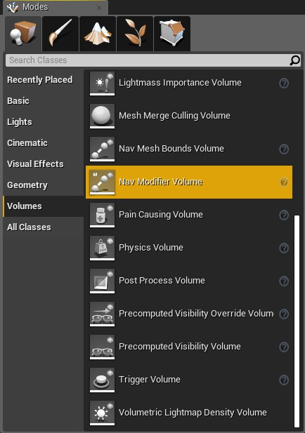

一旦这个体积被放置到地图中，默认值是移除体积内的Nav网格部分，如下面的截图所示:

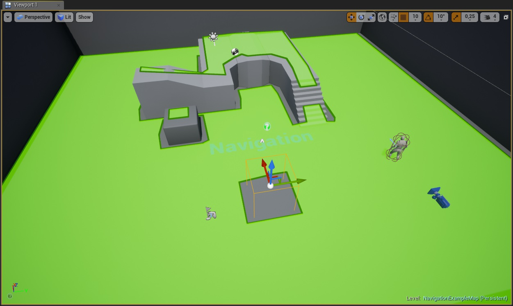

当你有不希望AI进入的区域，或者修复导航网格的工件时，这是很有用的。虽然Nav Modifier Volume指定了地图的一部分，行为是指定在Nav Modifier Areas。这意味着，如果我们查看Nav Mesh Modifier Volume的设置，我们只能找到一个与导航相关的，名为Area类:

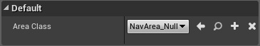

因此，此volume只能指定地图的一部分，其中特定的是Area类。默认情况下，Area类是NavArea\_Null，“移除”地图中重叠这个体积的部分的Nav网格。下一节我们将探讨Nav网格区域是如何工作的。

#### Nav Mesh Areas

在上一节中，我们讨论了地图的可导航区域并非都是一样的。如果有一个区域被认为是危险的，人工智能应该避免它。虚幻的内置导航系统能够使用costs处理这些不同的领域。这意味着人工智能将通过对路径上所有代价求和来评估路径，然后选择代价最小的路径。

另外，值得指出的是有两种类型的costs。对于每个区域，都有进入\(或离开\)该区域的初始costs和穿过该区域的costs。让我们看几个例子来说明两者之间的区别。

假设有一片森林，但是在森林的每一个入口，人工智能都需要向居住在森林中的土著居民支付费用。然而，一旦进入，人工智能可以自由移动，就像他们在森林之外。在本例中，进入森林是有代价的，但是一旦进入森林，就没有代价了。因此，当人工智能需要评估是否要穿越森林时，它取决于是否有另一条路要走以及需要多长时间。

现在，假设有一个地区有毒气。在第二个场景中，进入该区域的代价可能为零，但是穿过该区域的代价很高。事实上，人工智能在该地区停留的时间越长，它失去的健康值就越多。它是否值得进入不仅取决于是否有另一种路径以及该替代路径需要多长时间才能穿过\(就像前面的例子一样\)，还取决于一旦进入，AI需要多长时间才能穿过该区域。

在虚幻中，costs是在类内指定的。如果你点击一个Nav Modifier Volume，你会注意到你需要指定一个Area类，如下面的截图所示:


您可能已经猜到，默认值是NavArea\_Null，它的进入cost是无限的，导致AI永远不会进入该区域。导航系统非常聪明，甚至不需要生成该区域，而是将其视为不可导航区域。

但是，您可以更改Area类。默认情况下，您将能够访问以下Area类:

* **NavArea\_Default**；这是生成的默认区域。如果您想在同一位置有多个这样的修饰符，那么将它作为一个修饰符是很有用的。
* **NavArea\_LowHeight**：这表明，由于高度降低，该区域并不适合每一种代理\(例如，在通风隧道的情况下，不是所有的代理都适合/蹲下\)。
* **NavArea\_Null**：这使得该区域对所有代理都不可导航。
* **NavArea\_Obstacle**：这将为该地区分配更高的成本，因此代理将希望避免它。

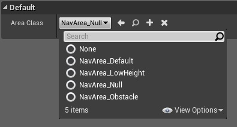

但是，您可以通过扩展NavArea类来扩展不同Areas的列表\(并可能添加更多的功能\)。让我们看看如何在Blueprint和C++中做到这一点。当然，正如我们在前一章所做的，我们是将创建一个名为Chapter3/Navigation的新文件夹，我们将在其中放置所有代码。

**在蓝图中创建NavArea**

在蓝图中创建一个新的NavArea类非常简单;你只需要创建一个从NavArea类继承的新蓝图，如下面的截图所示:

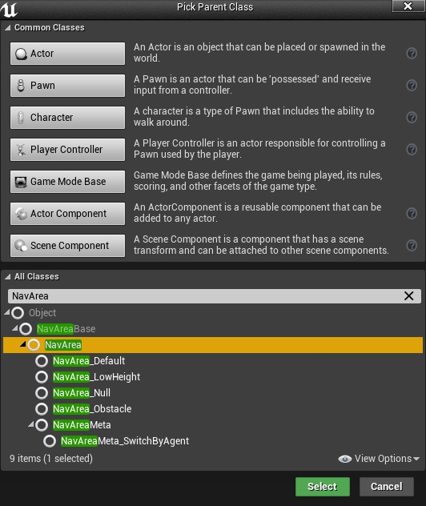

按照惯例，类的名称应该以“NavArea\_”开头。我们将在这里重命名为NavArea\_BPJungle\(我添加了BP来表示我们已经创建的这是关于蓝图的，因为我们在蓝图和C++中都在重复同样的任务\)。这是它在Content Browser中的样子:

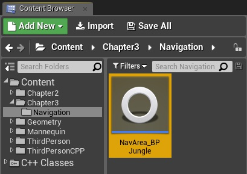

然后，如果您打开蓝图，您将能够分配自定义costs的Area。你也可以为你的区域指定一个特定的颜色，这样当你构建Nav网格时就很容易识别。这是细节面板默认的样子:

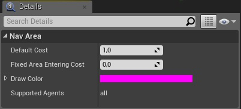

现在，我们可以根据我们的需要进行定制。例如，我们可能想要进入丛林的成本，以及穿越丛林的略高的成本。我们将使用明亮的绿色作为颜色，如下面的截图所示:

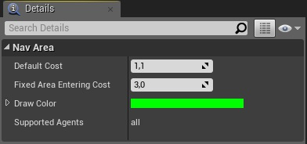

一旦编译并保存，我们就可以将这个新创建的Area分配给Nav Modifier Volume，如下图所示:

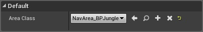

这是我们完成的类在我们的关卡中看起来的样子\(如果导航网格是可见的\):

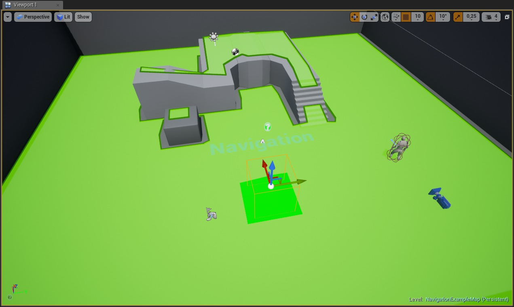

**在C++中创建NavArea**

在C++中创建NavArea类也很容易。首先，您需要创建一个新的C++类，它继承自NavArea类，如下面的截图所示:

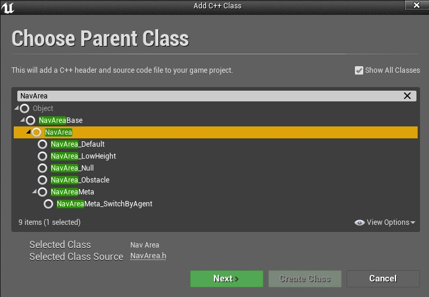

按照惯例，名字应该以“NavArea\_”开头。因此，你可以将它重命名NavArea\_Desert\(只是为了改变AI可以面对的地形类型，因为我们之前创建了一个丛林\)，并将它放到“Chapter3/Navigation”中:

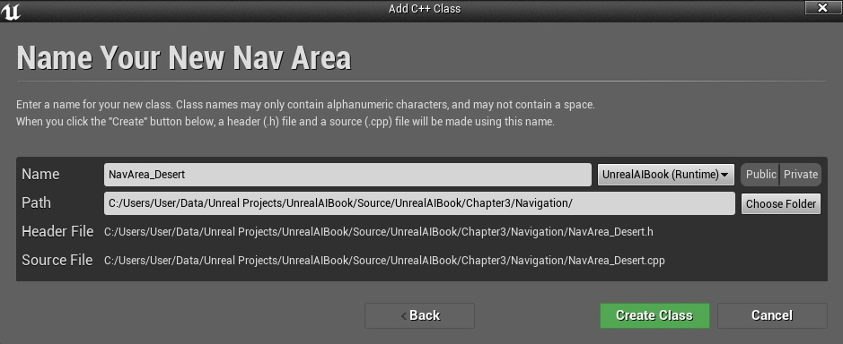

创建了类之后，只需在构造函数中分配参数。为了方便起见，下面是类定义，我们在其中声明了一个简单的构造函数:

```cpp
#include "CoreMinimal.h"
#include "NavAreas/NavArea.h"
#include "NavArea_Desert.generated.h"

/**
 * 
 */
UCLASS()
class UNREALAIBOOK_API UNavArea_Desert : public UNavArea
{
  GENERATED_BODY()
  UNavArea_Desert();

};
```

然后，在构造函数的实现中，我们可以分配不同的参数。例如，我们可能会有较高的输入成本和较高的穿过成本\(相对于默认值或丛林\)。此外，我们可以将颜色设置为黄色，这样我们就能记住它是沙漠区域:

```cpp
#include "NavArea_Desert.h"
UNavArea_Desert::UNavArea_Desert()
{
  DefaultCost = 1.5f;
  FixedAreaEnteringCost = 3.f;
  DrawColor = FColor::Yellow;
}
```

一旦你创建了类，你可以把它设置为Nav Modifier Volume的一部分，如下图所示:

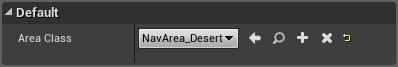

因此，你将能够在Nav网格看到你的自定义区域\(在这种情况下，是黄色\):

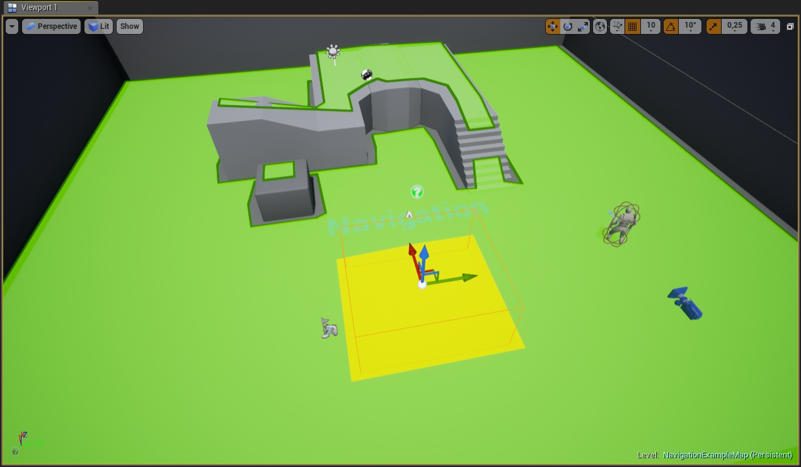

#### Nav Link Proxy

默认情况下，如果有一个ledge，人工智能不会掉下去，即使这是他们能走到目的地的最短路径。事实上，在顶部的导航网窗台不是\(直接\)连接到底部的导航网。 然而，虚幻导航系统提供了一种方法，通过所谓的Nav Link Proxy连接导航网格中的任意两个三角形。

让我们更详细地研究这个工具。

**创建Nav Link Proxy**

要用一个链接连接两个区域，我们需要在Mode面板All Classes选项卡，选择Nav Link Proxy，如下图所示:

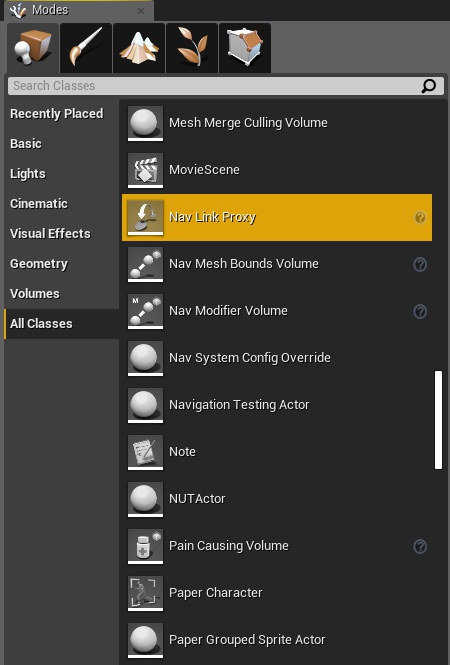

### 虚幻的导航系统

虚幻导航系统是基于一个导航网格\(简称Nav网格\)。它需要将可导航空间划分为若干区域——在本例中为多边形——为了提高效率，它们被细分为三角形。然后，为了到达某个位置，将每个三角形视为图的一个节点，如果两个三角形相邻，则将它们各自的节点连接起来。在这个图中，你可以执行寻路算法，比如使用欧几里得距离启发式的A _，或者甚至是更复杂的东西\(例如A_ 的变体或考虑不同成本的系统\)。这将在这些三角形之间产生一条路径，AI角色可以在其中行走。

为了能够使用导航系统，让我们了解设置导航系统的主要过程。在这个阶段，我们将不再关心系统底层的结构，而是关心如何使用它的所有特性。系统将完成其余的工作。同样，我们需要向导航系统提供有关地图的信息\(例如指定特定区域\)。通常情况下，你的团队中的AI程序员会处理这个任务，但如果你的团队很小，关卡设计师可能会处理这个任务。虽然没有一个具体的过程，倒不如说是一个迭代的过程，让我们探索不同的步骤-或工具，如果你喜欢-你可以在虚幻引擎中定义Nav网格。我们将在本章中详细研究它们:

* **Generation of the Navigation Mesh**：这是第一步。在你使用以下工具之前，重要的是生成一个Nav网格。这个步骤包括定义如何生成多边形、三角形、导航网格的精度，甚至是哪种代理将穿过这个特定的导航网格。
* **Navigation Mesh Modifiers**：并不是所有的Nav网格部分都是相等的，这是一个工具，用于指定Nav网格的哪些部分的行为应该不同。事实上，正如我们以前看到的，可能存在一个带有有毒气体的区域，代理希望避免这个部分，除非他们真的必须穿过它。Nav网格修改器允许你指定包含气体的区域是特殊的。但是，区域内的行为类型\(例如，此路径不应该被遍历，或者只能由具有游泳能力的代理遍历\)是在导航区域内指定的。
* **Navigation Areas**：这允许您指定特定类型的区域的行为方式，是否应该避免，等等。重要的是在执行Nav过滤以确定代理可以遍历哪些区域时。
* **Navigation Links**：这些可以连接两个不同的部分的Nav网格。假设你有一个平台。默认情况下，AI代理会找到另一种方法。如果你想到的是第三人称地图模板，那么需要从平台上下来的代理将会绕着这个区域走楼梯，而不是从平台上掉下来或跳下。导航链接允许你连接平台顶部和下方的部分导航网格。因此，AI角色可能会从平台上掉下来。然而，请注意Nav链接可以连接Nav的两个通用部分网格，从而允许寻路通过跳跃，传送等找到它的路。
* **Nav Filtering**：我们不一定要在任何场合都以同样的方式找到一条路。Nav过滤允许我们定义如何执行特定实例的路径查找的特定规则\(在特定时间调用路径查找来寻找路径\)。

让我们把这些要点分解并更详细地讨论一下：

### 生成导航网格

在Unreal中生成一个简单的导航网格非常简单。我们来看看怎么做。在Mode面板中，在Volume选项卡中，你可以找到Nav Mesh Bounds Volume，如下截图所示:进入翻译页面


把它拖到世界上。您将注意到，相对于地图而言，体积是相当小的。在这个体积内的一切将被考虑到生成一个Nav网格。当然，一个导航网格有很多参数，但现在让我们保持默认。

如果你按下键盘上的P按钮，你就可以在视窗中看到Nav网格，如下图所示:


正如你所看到的，它被限制在Nav Mesh Bounds Volume范围内。让我们缩放Nav Mesh Bounds Volume，以适应我们的关卡。你的关卡应该是这样的:


你有没有注意到，当你缩放你的volume,时，导航网格是如何自动更新的?这是因为，在虚幻中每次有影响导航网格的东西移动时，都会生成导航网格。更新时，受影响的部分\(即更新后的部分\)将变成红色，如下图所示:


这就是如何容易生成一个导航网格。然而，为了能够掌握这个工具，我们需要学习更多关于如何细化Nav网格和它是如何被AI使用的。

### 设置导航网格的参数

如果你点击Nav Mesh Bounds Volume，你会发现没有生成Nav网格的选项。实际上，一些参数位于项目级别，而其他参数位于地图级别。

让我们选择到World Outliner，在那里你会发现场景中已经放置了默认的RecastNavMesh- Default actor，如下截图所示:


事实上，当你拖动Nav Mesh Bounds Volume，如果地图没有RecastNavMesh-Default，将自动创建一个。如果我们点击它，我们可以在细节面板中更改它的所有属性。

可以看到，有很多默认值。这些可以在项目设置\(在导航网格选项卡下\)。让我们拆分每个部分，并尝试掌握围绕它们的主要概念。

#### 显示设置

顾名思义，这些设置与我们如何可视化详细生成的导航网格有关。特别是，我们将能够看到生成的多边形，三角形，以及多边形是如何连接的。我们将在第12章中更详细地讨论这些问题，当我们谈到调试工具时:


#### 生成设置

这些设置关系到Nav网格的生成。通常，一开始使用默认值是非常完美的，因此只有在知道自己在做什么时才应该接触这些值。下面的截图显示了这些设置:


了解这些设置的最佳方法是使用它们的参数，开始前，让我们看看主要的几点:

* **Tile Size UU**：这个参数定义了生成的多边形的精细程度。更低的值意味着更精确的导航网格，有更多的多边形，但也会更慢的生成时间\(以及可能更多的内存使用\)。通过在显示设置中启用“绘制三角形边”，可以看到此参数的效果。
* **Cell Height**：这决定了产生的网格离地板有多高\(这可能导致不同的高度连接，所以要小心\)。
* Agent settings \(**Radius**, **Height**, **Max Height**, **Max Slope**, **Max Step Height**\):这些设置是特定于您的代理的，应该适当地指定。特别地，这些是一个代理应该穿过这个Nav网格的最小值。因此，导航网格将无法与小于此值的代理导航，因为导航网格仅为具有这些要求的代理生成。这些设置对于为你的代理生成一个合适的导航网非常有用，而不会浪费资源在你的代理永远无法导航的区域上。
* **Min Region Area**：这样可以消除Nav网格生成中的某些不重要而无法导航的工件。

剩下的许多设置都是关于优化的，它们可能是难以理解的，特别是对于人工智能编程新手。因此，我决定在本书中不包括这些细节。但是，一旦您对使用导航系统有了信心，您可以查看这些设置的工具提示，并对它们进行试验，以便了解它们的作用。

#### 项目设置

值得一提的是，即使我们不详细介绍它们，也可以从项目设置中更改相同的导航设置；有一个特定的选项卡，如下图所示：


有趣的是关于代理的最后一个选项卡。在这里可以创建一个支持的代理的数组，这样不同的代理可以有不同的方式浏览Nav网格。例如，一只老鼠可能和Giant Troll有一个不同的导航网格。事实上，老鼠也可以进入小洞，而Giant Troll不能。在这里，您将能够指定所有不同类型的代理:


你不能直接指定你的角色将遵循哪种类型的代理，但是，基于 Character Movement组件\(或一般的Movement组件\)，一种代理会被分配给 Character/AI代理。

**在Character Movement组件中设置**

正如我们在上一节中所看到的代理的能力，它的形状等等……对导航网格的导航方式有很大影响。您将能够在Character Movement组件上找到这些设置。

但是，这个组件超出了本书的范围，我们将不会看到它。

### 修改导航网格

到目前为止，我们已经了解了如何生成一个导航网格。但是，我们想修改一下，使它更适合我们的需要。正如我们之前提到的，可能会有不同的区域需要花费很大的代价才能穿过，或者可能会有一个在导航网的两个点之间的连接，而它们是分开的。

因此，本节探讨了Unreal中修改导航网格的不同工具，使它可以适应地图。

#### Nav Modifier Volume

好了-是时候看看我们如何开始修改Nav网格了。例如，可能有一部分Nav网格我们不想交叉，或另一部分我们想有不同的属性。我们可以通过使用Nav Modifier Volume来做到这一点。

你可以通过进入Model面板，在Volume选项卡下找到这个设置，然后进入Nav Mesh Bounds Volume:


一旦这个体积被放置到地图中，默认值是移除体积内的Nav网格部分，如下面的截图所示:


当你有不希望AI进入的区域，或者修复导航网格的工件时，这是很有用的。虽然Nav Modifier Volume指定了地图的一部分，行为是指定在Nav Modifier Areas。这意味着，如果我们查看Nav Mesh Modifier Volume的设置，我们只能找到一个与导航相关的，名为Area类:


因此，此volume只能指定地图的一部分，其中特定的是Area类。默认情况下，Area类是NavArea\_Null，“移除”地图中重叠这个体积的部分的Nav网格。下一节我们将探讨Nav网格区域是如何工作的。

#### Nav Mesh Areas

在上一节中，我们讨论了地图的可导航区域并非都是一样的。如果有一个区域被认为是危险的，人工智能应该避免它。虚幻的内置导航系统能够使用costs处理这些不同的领域。这意味着人工智能将通过对路径上所有代价求和来评估路径，然后选择代价最小的路径。

另外，值得指出的是有两种类型的costs。对于每个区域，都有进入\(或离开\)该区域的初始costs和穿过该区域的costs。让我们看几个例子来说明两者之间的区别。

假设有一片森林，但是在森林的每一个入口，人工智能都需要向居住在森林中的土著居民支付费用。然而，一旦进入，人工智能可以自由移动，就像他们在森林之外。在本例中，进入森林是有代价的，但是一旦进入森林，就没有代价了。因此，当人工智能需要评估是否要穿越森林时，它取决于是否有另一条路要走以及需要多长时间。

现在，假设有一个地区有毒气。在第二个场景中，进入该区域的代价可能为零，但是穿过该区域的代价很高。事实上，人工智能在该地区停留的时间越长，它失去的健康值就越多。它是否值得进入不仅取决于是否有另一种路径以及该替代路径需要多长时间才能穿过\(就像前面的例子一样\)，还取决于一旦进入，AI需要多长时间才能穿过该区域。

在虚幻中，costs是在类内指定的。如果你点击一个Nav Modifier Volume，你会注意到你需要指定一个Area类，如下面的截图所示:


您可能已经猜到，默认值是NavArea\_Null，它的进入cost是无限的，导致AI永远不会进入该区域。导航系统非常聪明，甚至不需要生成该区域，而是将其视为不可导航区域。

但是，您可以更改Area类。默认情况下，您将能够访问以下Area类:

* **NavArea\_Default**；这是生成的默认区域。如果您想在同一位置有多个这样的修饰符，那么将它作为一个修饰符是很有用的。
* **NavArea\_LowHeight**：这表明，由于高度降低，该区域并不适合每一种代理\(例如，在通风隧道的情况下，不是所有的代理都适合/蹲下\)。
* **NavArea\_Null**：这使得该区域对所有代理都不可导航。
* **NavArea\_Obstacle**：这将为该地区分配更高的成本，因此代理将希望避免它。


但是，您可以通过扩展NavArea类来扩展不同Areas的列表\(并可能添加更多的功能\)。让我们看看如何在Blueprint和C++中做到这一点。当然，正如我们在前一章所做的，我们是将创建一个名为Chapter3/Navigation的新文件夹，我们将在其中放置所有代码。

**在蓝图中创建NavArea**

在蓝图中创建一个新的NavArea类非常简单;你只需要创建一个从NavArea类继承的新蓝图，如下面的截图所示:


按照惯例，类的名称应该以“NavArea\_”开头。我们将在这里重命名为NavArea\_BPJungle\(我添加了BP来表示我们已经创建的这是关于蓝图的，因为我们在蓝图和C++中都在重复同样的任务\)。这是它在Content Browser中的样子:


然后，如果您打开蓝图，您将能够分配自定义costs的Area。你也可以为你的区域指定一个特定的颜色，这样当你构建Nav网格时就很容易识别。这是细节面板默认的样子:


现在，我们可以根据我们的需要进行定制。例如，我们可能想要进入丛林的成本，以及穿越丛林的略高的成本。我们将使用明亮的绿色作为颜色，如下面的截图所示:


一旦编译并保存，我们就可以将这个新创建的Area分配给Nav Modifier Volume，如下图所示:


这是我们完成的类在我们的关卡中看起来的样子\(如果导航网格是可见的\):


**在C++中创建NavArea**

在C++中创建NavArea类也很容易。首先，您需要创建一个新的C++类，它继承自NavArea类，如下面的截图所示:


按照惯例，名字应该以“NavArea\_”开头。因此，你可以将它重命名NavArea\_Desert\(只是为了改变AI可以面对的地形类型，因为我们之前创建了一个丛林\)，并将它放到“Chapter3/Navigation”中:


创建了类之后，只需在构造函数中分配参数。为了方便起见，下面是类定义，我们在其中声明了一个简单的构造函数:

```cpp
#include "CoreMinimal.h"
#include "NavAreas/NavArea.h"
#include "NavArea_Desert.generated.h"

/**
 * 
 */
UCLASS()
class UNREALAIBOOK_API UNavArea_Desert : public UNavArea
{
  GENERATED_BODY()
  UNavArea_Desert();

};
```

然后，在构造函数的实现中，我们可以分配不同的参数。例如，我们可能会有较高的输入成本和较高的穿过成本\(相对于默认值或丛林\)。此外，我们可以将颜色设置为黄色，这样我们就能记住它是沙漠区域:

```cpp
#include "NavArea_Desert.h"
UNavArea_Desert::UNavArea_Desert()
{
  DefaultCost = 1.5f;
  FixedAreaEnteringCost = 3.f;
  DrawColor = FColor::Yellow;
}
```

一旦你创建了类，你可以把它设置为Nav Modifier Volume的一部分，如下图所示:


因此，你将能够在Nav网格看到你的自定义区域\(在这种情况下，是黄色\):


#### Nav Link Proxy

默认情况下，如果有一个ledge，人工智能不会掉下去，即使这是他们能走到目的地的最短路径。事实上，在顶部的导航网窗台不是\(直接\)连接到底部的导航网。 然而，虚幻导航系统提供了一种方法，通过所谓的Nav Link Proxy连接导航网格中的任意两个三角形。

让我们更详细地研究这个工具。

**创建Nav Link Proxy**

要用一个链接连接两个区域，我们需要在Mode面板All Classes选项卡，选择Nav Link Proxy，如下图所示:


一旦链接被放置在关卡中，你会看到一个“箭头/链接”，你可以修改链接的起始点和结束点。它们被称为Left和Right，设置它们位置的最简单的方法是将它们拖放到视窗中。因此，你将能够连接Nav网格的两个不同部分。正如我们在下面的截图中看到的，如果Nav网格是可见的\(用P键启用\)，你会看到一个箭头连接左右节点。这个箭头指向两个方向。这将导致链接是双向的:


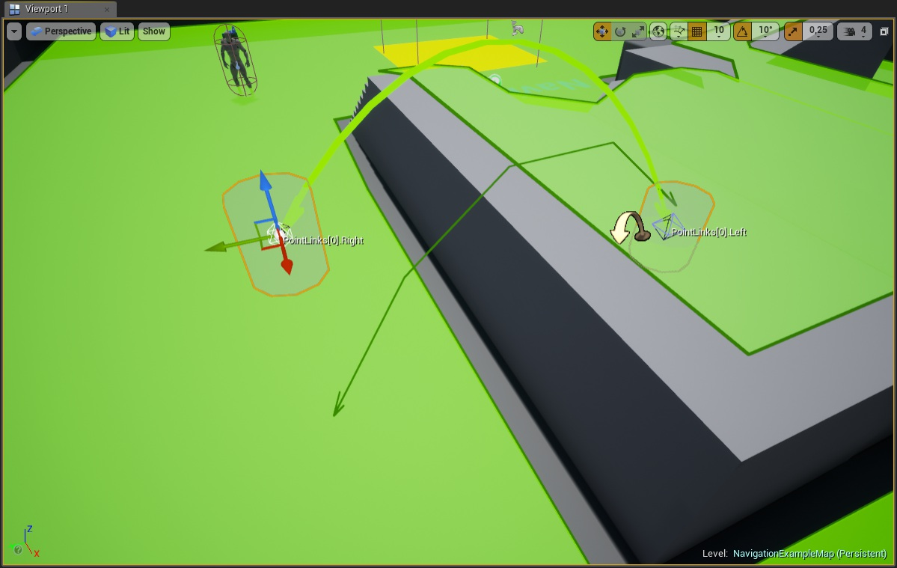

如果你想让链接只在一个方向上运行，我们可以在细节面板中改变这个设置。但是，要研究这些设置，我们首先需要了解有两种不同类型的链接:简单链接和智能链接。

#### 简单链接和智能链接

当我们创建一个Nav Link Proxy，它带来了一个简单的链接数组。这意味着与一个单一的Nav Link Proxy，我们可以连接的不同部分Nav交织在一起时。然而，Nav Link Proxy带来了一个单一的智能链接，默认情况下是禁用的。

让我们来学习简单链接和智能链接之间的异同。

**Both Simple and Smart Links**

简单链接和智能链接的行为方式相似，它们将导航网的两个部分连接在一起。此外，这两种类型的链接都可以有方向\(从左到右，从右到左，或者双向\)和Nav Area\(链接所在的导航区域;例如，在使用此链接时，您可能希望可以自定义cost\)。

**简单链接**

简单链接存在于Nav Proxy Link中的Point Links Array中，这意味着在一个Nav Proxy Link中可能存在多个简单链接。要创建另一个简单链接，可以向数组中添加额外的元素细节面板中的简单节点，如下面的截图所示:

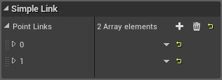

一旦我们有了更多的简单链接，我们就可以设置开始和结束位置，就像我们对第一个链接所做的那样\(通过选择它们并像其他actor一样在Viewport中移动它们\)。下面的屏幕截图显示了我放置了两个简单的链接在Nav Proxy Link旁边:

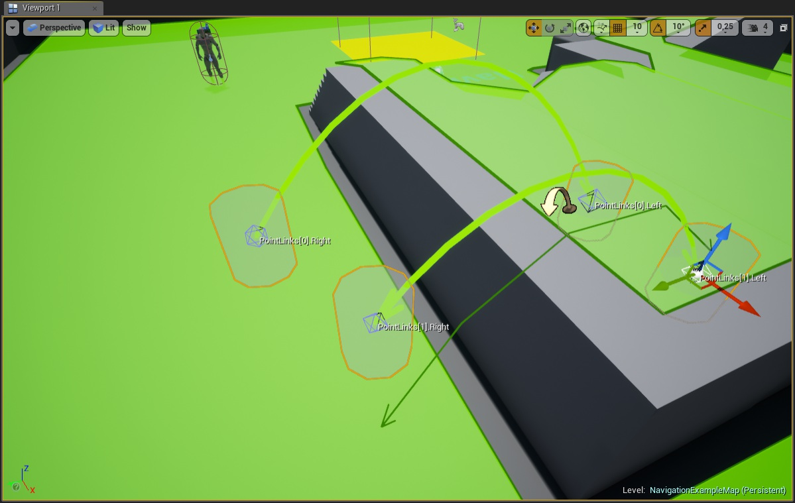

对于Point Links Array中的每个简单链接，我们都可以通过展开项来访问其设置。下面的截图显示了第一个简单链接的设置:

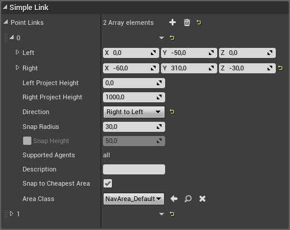

让我们来了解一下这些不同的设置:

* **Left and Right**：链接的左右两端的位置。
* **Left Project Height and Right Project Height**：如果该数字大于零，则链接将分别向下投影到左侧和的导航几何图形\(使用由该数字指定的最大长度的跟踪\)链接的右端。你可以在下面的截图中看到这个投影链接:


* **Direction**：这指定了链接工作的方向。同时，视窗中的箭头也会相应地更新。可能的选择如下:
  * **Both Ways**：链接是双向的\(记住AI需要具备双向穿越链路的能力;例如，如果我们要越过一个平台，则代理需要能够从其上跌落（链路的一个方向）并跳跃（链路的另一个方向）。
  * **Left to Right**：该链接只能从左端到右端\(代理仍然需要能够沿着该链接方向前进\)。
  * **Right to Left**：该链接只能从右端到左端\(代理仍然需要能够沿着该链接方向前进\)。
* **Snap Radius and Height Radius**：你可能已经注意到每个链接末端都有一个圆柱体。这两个设置控制半径和圆柱体的高度。检查cost最小的区域，以获得关于此圆柱使用的更多信息。下面的截图显示，第一个链接有一个更大的圆柱体\(半径和更高\):

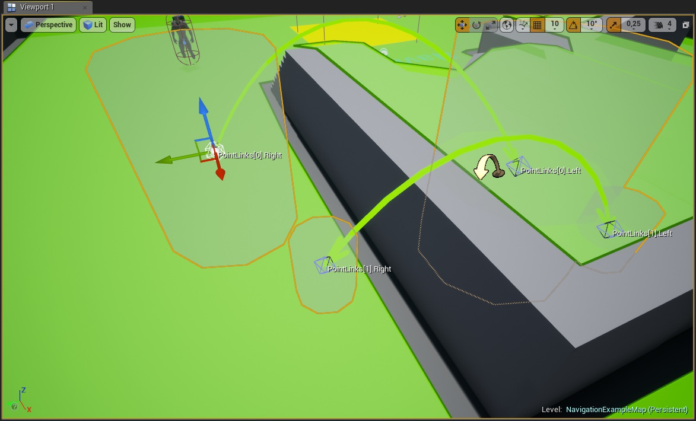

* **Description**：这只是一个字符串，为了方便你可以插入描述;它对导航或链接没有影响。
* **Snap to Cheapest Area**：如果启用，它将尝试将链接末端连接到圆柱内可用三角形中cost最小的区域，该区域由单元半径和高度半径指定。例如，如果圆柱体与Default Nav Area和BPJungle Nav Area都相交\(我们之前创建的\)，该链接将直接连接到Default Nav Area，而不是丛林。
* **Area Class**：该链接可能需要有一定的cost才能穿过，或者具有特定的Nav Area。此参数允许您定义穿过该链接时属于哪种类型的Nav Area。

这就是简单链接。然而，这是一个非常强大的工具，可以让你构造Nav Mesh，并实现惊人的AI行为。现在，让我们进入智能链接。

**智能链接**

可以在运行时使用“Smart Link Is Relevant”启用和禁用“智能链接”。您还可以通知周围的Actors。默认情况下，它是不相关的，每个Nav Proxy Link只有一个智能链接。

不幸的是\(至少对于当前的引擎版本\)，这些在编辑器中是不可见的，这意味着需要手动设置开始和结束位置。

不过，让我们来看看智能链接的设置：

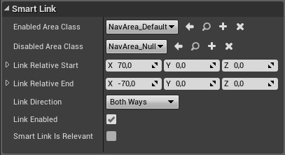

* **Enabled Area Class**：这是该链接启用时默认的Nav Area。默认值是NavArea\_Default。
* **Disabled Area Class**：这是链路被禁用时假定的Nav Area。这意味着，当链接被禁用时，如果分配了一个可交叉的区域，它仍然可以穿过\(例如，当链接被禁用时，我们可能希望有一个非常高的成本，但我们仍然希望它是可以穿过的。当然，默认值是NavArea\_Default，这意味着它是不可穿过的）。
* **Link Relative Start**：这表示链接的起点，相对于它的Nav Link Proxy的位置。
* **Link Relative End**：这表示链接的终点，相对于它的Nav Link Proxy的位置。
* **Link Direction**：这指定了链接工作的方向。可能的选择如下:
  * **Both Ways**：链路是双向的\(记住AI需要具备双向穿越链路的能力;例如，在一个突出的地方，代理人需要能够从上面掉下来\(链接的一个方向\)和跳跃\(链接的另一个方向\)。
  * **Left to Right**：该链接只能从左端到右端\(代理仍然需要能够沿着该链接方向前进\)。
  * **Right to Left**：该链接只能从右端到左端\(代理仍然需要能够沿着该链接方向前进\)。
* **Link Enabled**：这是一个布尔变量，它决定是否智能启用链接。这个值可以在运行时更改，链接也可以更改“通知”周围对这些信息感兴趣的代理/参与者\(更多信息请参阅后面\)。默认值为true。
* **Smart Link Is Relevant**：这是一个布尔变量，用于确定智能链接是否实际处于“活动”状态，也就是说，它是否相关，或者我们是否应该忽略它。默认值为false。

这些是关于智能链接的主要设置。

值得一提的是，智能链接实际上可以做的不仅仅是Nav Meshes。它们有一系列函数来处理穿过该代理链接。例如，通过打开NavLinkProxy.h文件，我们可以找到以下函数:

```cpp
  /** called when agent reaches smart link during path following, use ResumePathFollowing() to give control back */
  UFUNCTION(BlueprintImplementableEvent)
  void ReceiveSmartLinkReached(AActor* Agent, const FVector& Destination);

  /** resume normal path following */
  UFUNCTION(BlueprintCallable, Category="AI|Navigation")
  void ResumePathFollowing(AActor* Agent);

  /** check if smart link is enabled */
  UFUNCTION(BlueprintCallable, Category="AI|Navigation")
  bool IsSmartLinkEnabled() const;

  /** change state of smart link */
  UFUNCTION(BlueprintCallable, Category="AI|Navigation")
  void SetSmartLinkEnabled(bool bEnabled);

  /** check if any agent is moving through smart link right now */
  UFUNCTION(BlueprintCallable, Category="AI|Navigation")
  bool HasMovingAgents() const;
```

不幸的是，这些函数超出了本书的范围，但我邀请您阅读代码以了解更多关于它们的知识。

在前面，我们提到智能链接可以在运行时向附近的代理/参与者广播关于其状态更改的信息。您可以使用广播设置更改智能链接广播此信息的方式，广播设置位于智能链接设置的正下方：

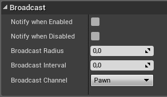

这些设置相当直观，但让我们快速浏览一下:

* **Notify when Enabled**:如果为true，则链接将在启用时通知代理/参与者。
* **Notify when Disabled**:如果为true，则链接将在禁用时通知代理/参与者。
* **Broadcast Radius**：它指定广播应该走多远。此半径以外的每个代理都不会收到有关链接更改的通知。
* **Broadcast Interval**：这将指定链接应在多长时间后重复广播。如果该值为零，则广播仅重复一次。
* **Broadcast Channel**：这是用于更改广播的跟踪通道。我们关于智能链接的讨论到此结束。

#### Nav Link Proxy的其他设置

最后，值得一提的是，Nav Link Proxy 可以在生成Nav网格时创建一个障碍框。您可以在Nav Link Proxy 的详细信息面板中找到这些设置，如以下屏幕截图所示：

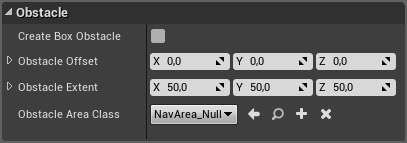

这些设置允许你决定障碍框是否活动/使用，它的尺寸/范围和偏移量，以及导航区域的类型。

#### 扩展Nav Link Proxy

如果您想知道是否可以扩展链接或将它们包含在更复杂的actors中，那么答案是“当然可以!”但是你只能在C++中扩展它们。

因为这本书不能涵盖一切，所以我们没有时间详细讨论这个问题。但是，您可能希望扩展Nav Link Proxy 的一些原因是为了更好地控制输入链接的characters。例如，您可能需要一个跳板来推动character通过链接。这并不复杂，如果你在网上搜索，你会发现很多关于如何使用导航链接来完成这项工作的教程。

只要记住，要成为一个好的AI程序员，你将最终需要掌握这部分导航链接，但现在，足够我们用了。

#### 导航中的避障

导航避障是一个非常广泛的话题，虚幻有一些子系统为我们做这个。因此，我们将在第6章“集群”中讨论这个话题。

#### Navigation Filter

我们不想每次都以同样的方式找到一条路。想象一下，我们的强化了人工智能代理，它能够以两倍的速度穿越丛林。在这种情况下，导航系统不会意识到这种变化，也不会永久改变导航网格的形状或权重。

Nav过滤允许我们定义具体的规则如何执行特定时期的路径发现。您可能已经注意到，每次我们执行导航任务时，无论是在蓝图还是C++中，都有一个可选参数用于插入Nav过滤器。下面是一些带有可选过滤器参数的蓝图节点\(C++函数也是如此\)的例子:

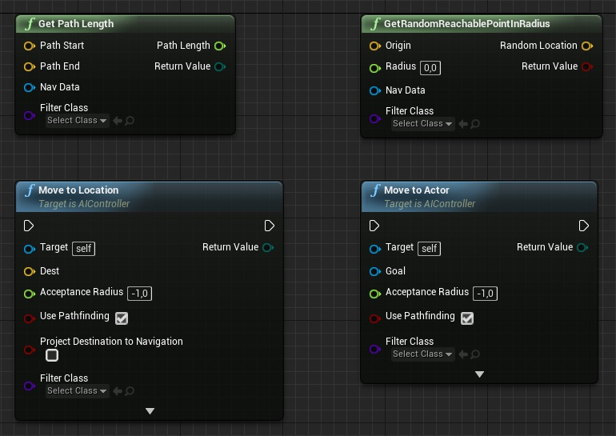

即便是行为树的Move To节点也有导航过滤器选项:

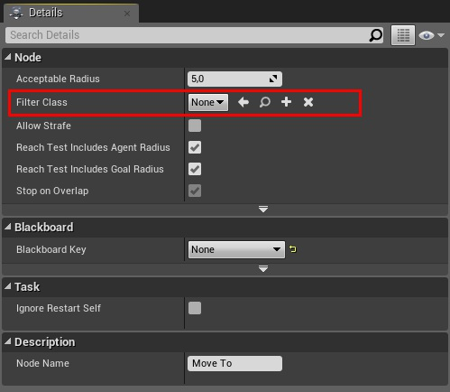

当然，一旦您插入了一个过滤器，寻路将相应地表现出来。这意味着使用Nav过滤器非常简单。但是，如何创建导航过滤器？让我们在蓝图和C++中找到答案。

#### 在蓝图中创建Navigation Filter

在本章之前，我们在蓝图中创建了一个丛林区域。因此，这似乎是一个很好的例子，我们可以使用它来创建一个Nav过滤器，允许AI代理更快地穿越丛林，甚至比穿越Nav网格的默认区域还要快。让我们想象一下，人工智能代理有某种力量或能力，可以让它在丛林型区域移动得更快。

要在蓝图中创建Navigation Filter，我们需要开始创建继承自NavigationQueryFilter的新蓝图，如下图所示：

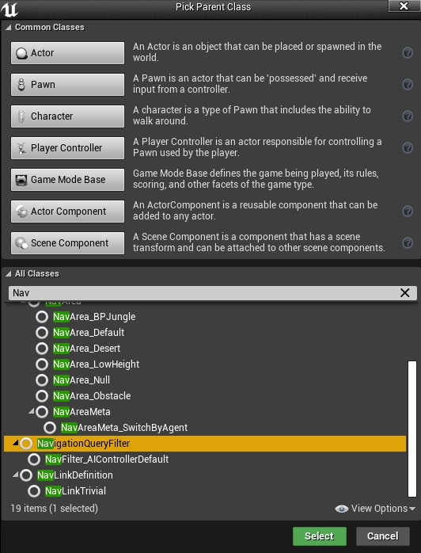

按照惯例，类的名称应该以“NavFilter\_”开头。我们将把它命名为NavFilter\_BPFastJungle（我添加了BP，这样我就可以记住，我用蓝图创建了这个，因为我们在蓝图和C++中有相同的任务）。这就是它在内容浏览器中的外观：

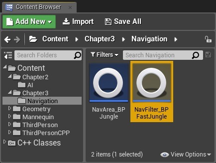

一旦我们打开蓝图，我们会在细节面板中找到它的选项:

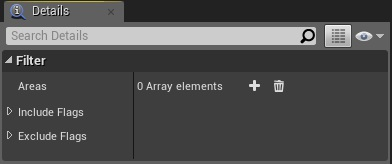

如您所见，有一个Array of Areas和两个包含和排除（Nav）标志集。不幸的是，我们没有覆盖Nav Flags，因为它们超出了本书的范围，它们只能在C++中使用。然而，这些Array of Areas非常有趣。让我们添加一个新Area使用我们的NavArea\_BPJungle创建Area类，如下面的截图所示:

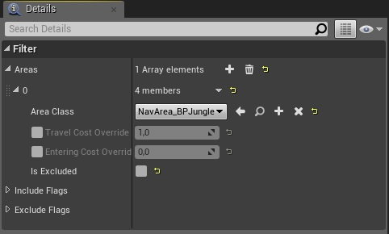

现在，我们可以覆盖丛林区域的Travel Cost和Entering Cost，如果使用这个过滤器，将使用这些成本来代替我们在Area类中指定的成本。记住勾选选项名称旁边的复选框以启用编辑。例如，我们可以有0.6的Travel Cost\(因为我们可以快速穿过丛林而没有任何问题\)和Entering Cost为0:

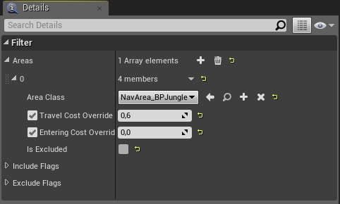

如果你还遵循C++部分的Nav Areas，那么你也应该在你的项目中拥有沙漠区域。作为可选步骤，我们可以向过滤器添加第二个区域。想象一下，通过在丛林中使用更强的或快速移动的能力，我们的角色对太阳非常敏感，并且非常容易被太阳晒伤，这会显著降低他们的健康。因此，如果使用这种过滤器，我们可以为沙漠地区设定更高的成本。只需添加另一个区域，并将Area类设置为NavArea\_Desert。然后，覆盖成本；例如，Travel Cost为2.5，Entering Cost为10：

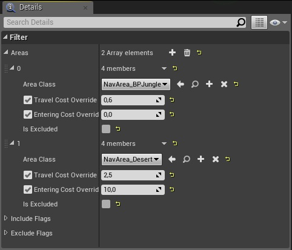

完成设置编辑后，保存蓝图。从现在开始，您将能够在导航系统中使用这个过滤器。这就总结了如何在蓝图中创建一个导航过滤器。

#### 在C++中创建Navigation Filter

与蓝图类似，我们可以创建一个C++ Nav过滤器。这一次，我们可以创建一个过滤器，稍微降低沙漠地区的成本。你可以对生活在沙漠中的某些动物使用这个过滤器，这样它们就不容易受到它的影响。

首先，我们需要创建一个新的C++类继承自NavigationQueryFilter,如下面的截图所示：

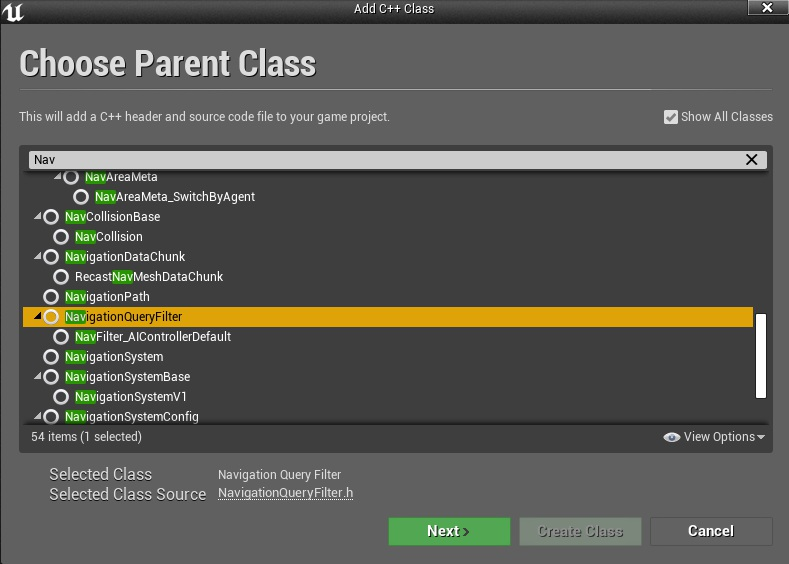

按照惯例，类的名称应该以“NavFilter\_”开头。因此，我们将它重命名为NavFilter\_DesertAnimal并将其放在“Chapter3/Navigation”:

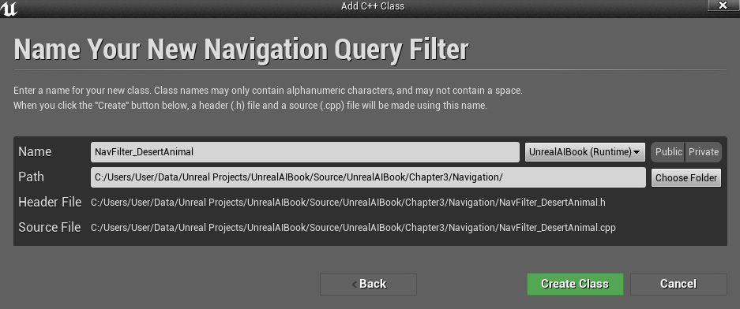

要设置它的属性，我们需要创建一个默认构造函数。在头文件\(.h\)中写入以下内容:

```cpp
#include "CoreMinimal.h"
#include "NavFilters/NavigationQueryFilter.h"
#include "NavFilter_DesertAnimal.generated.h"
/**
 * 
 */
UCLASS()
class UNREALAIBOOK_API UNavFilter_DesertAnimal : public UNavigationQueryFilter
{
  GENERATED_BODY()
  UNavFilter_DesertAnimal();
};
```

对于实现（.cpp文件），我们需要做更多的工作。首先，我们需要进入我们需要的导航区域，在这种情况下，这就是沙漠。让我们添加以下“\#include”语句：

```cpp
#include "NavArea_Desert.h"
```

然后，在构造函数中，我们需要创建一个FNavigationFilterArea，它是一个包含筛选特定类的所有选项的类。在我们的例子中，我们可以将这个新的过滤器区域存储在一个名为Desert的变量中:

```cpp
UNavFilter_DesertAnimal::UNavFilter_DesertAnimal() {
  //Create the Navigation Filter Area
  FNavigationFilterArea Desert = FNavigationFilterArea();
  // [REST OF THE CODE]
}
```

接下来，我们需要用我们想为这个类覆盖的选项填充Desert变量，包括我们要修改的Nav Area:

```cpp
UNavFilter_DesertAnimal::UNavFilter_DesertAnimal() {
  // [PREVIOUS CODE]
 //Set its parameters
  Desert.AreaClass = UNavArea_Desert::StaticClass();
  Desert.bOverrideEnteringCost = true;
  Desert.EnteringCostOverride = 0.f;
  Desert.bOverrideTravelCost = true;
  Desert.TravelCostOverride = 0.8f;
  // [REST OF THE CODE]
}
```

最后，我们需要在Area数组中添加这个Filter Area:

```cpp
UNavFilter_DesertAnimal::UNavFilter_DesertAnimal() {
  // [PREVIOUS CODE]
  //Add it to the the Array of Areas for the Filter.
  Areas.Add(Desert);
}
```

为了您的方便，这里是完整的。cpp文件:

```cpp
#include "NavFilter_DesertAnimal.h"
#include "NavArea_Desert.h"
UNavFilter_DesertAnimal::UNavFilter_DesertAnimal() {
  //Create the Navigation Filter Area
  FNavigationFilterArea Desert = FNavigationFilterArea();
  //Set its parameters
  Desert.AreaClass = UNavArea_Desert::StaticClass();
  Desert.bOverrideEnteringCost = true;
  Desert.EnteringCostOverride = 0.f;
  Desert.bOverrideTravelCost = true;
  Desert.TravelCostOverride = 0.8f;
  //Add it to the the Array of Areas for the Filter.
  Areas.Add(Desert);
}
```

编译这段代码，下次需要使用导航系统时就可以使用这个过滤器了。关于导航过滤器的讨论到此结束。

### 覆盖导航系统

在Mode面板中，您可以拖动一个名为Nav System Config Override的特殊actor到关卡中。

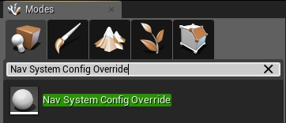

该actor允许您通过使用另一个actor覆盖内置导航系统。当然，您必须首先开发它，这将需要大量的工作。

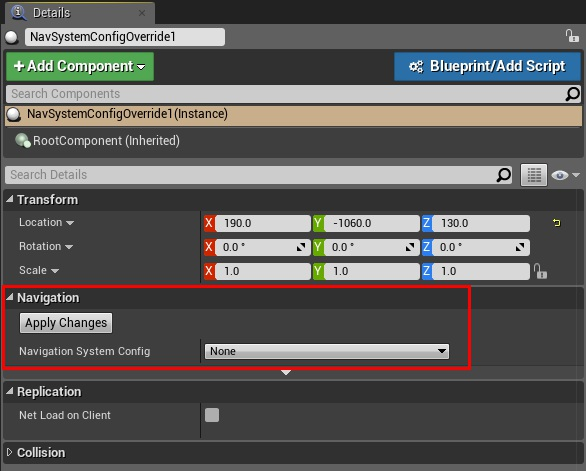

为什么要替换默认导航系统\(或者可能与其他导航系统一起使用\)，主要是因为要克服一些限制。那么空军呢?他们如何进行3D寻路?有地面寻路能力的蜘蛛呢?

### 总结

在本章中，我们了解了如何设置导航系统，以便我们的导航系统AI角色可以在地图上移动。特别地，我们已经学习了如何用Modifier Volumes，Nav Link Proxies和NavMesh来塑造导航网格区域。

因此，我们的人工智能代理可以顺利地在地图中导航，高效地找到基于其优化的两点之间的路径\(例如使用导航过滤器\)，以适应不同类型的“地形”的地图\(例如使用导航区域\)。此外，他们还会在平台上摔倒或跳跃\(比如使用Nav Link Proxies和一些跳跃代码\)。

在下一章中，我们将学习虚幻框架中更高级的人工智能特性，即环境查询系统，它允许代理“查询”环境，以便找到具有特定需求的位置\(或actors\)。

