# 第四章

## 环境查询系统

一个好的领导者知道哪个地方是好的，而EQS知道得更好！

欢迎来到第四章，环境查询系统。在这一章中，我们将使用虚幻人工智能框架中一个特定的非常强大的系统。我说的是环境查询系统（EQS）。我们将探索这个系统，不仅了解它是如何工作的，还将了解如何在我们的游戏中有效地使用它。

再次，EQS属于决策领域，特别是评估满足某些条件的哪个地方最适合。我们将通过本章详细了解它是如何工作的，但是作为我们将要讨论的内容的一个预期，我们知道系统过滤器提供了不同的可能性，而其余的过滤器分配一个分数。选择得分最高的选项。

我们将特别介绍以下主题：

* 如何开启**EQS**
* 理解**EQS工作原理**
* 学习**Generators, Tests, and Contexts**
* 探索EQS中的**built-in Generators, Tests, and Contexts**
* 使用自定义的**Generators, Tests, and Contexts**拓展EQS

### 开启EQS

EQS是一个早在Unreal 4.7中就引入的特性，在4.9中有了很大的改进。然而，在版本4.22中，EQS被列为一个实验特性，它在许多游戏中被成功地使用，从而揭示了EQS是健壮的。

因此，我们需要从实验特性设置启用它。从顶部菜单，转到“Edit \| Editor Preferences…”，如下图所示：

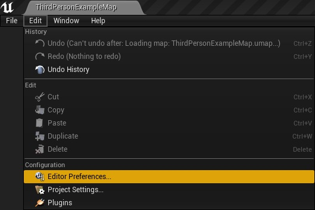

从横向菜单中，您将能够看到名为“Experimental”的部分（在“General”类别下），如以下屏幕截图中突出显示的：

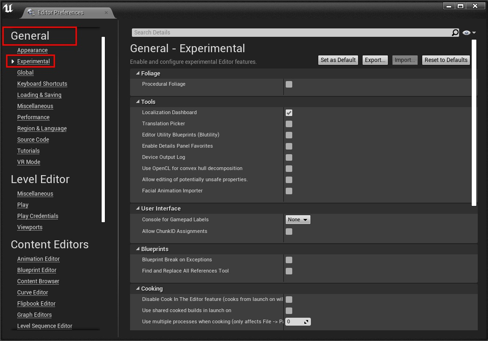

如果您在设置中向下滚动，您将找到AI类别，在该类别中您可以启用环境查询系统：

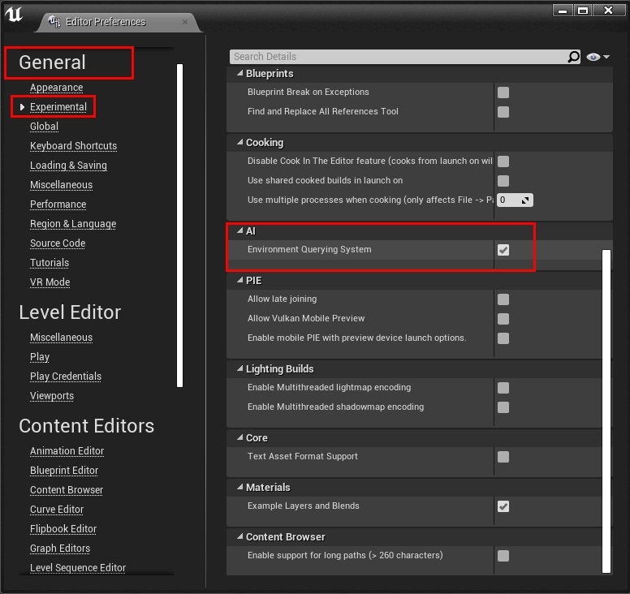

选中此选项旁边的复选框，则整个项目中将激活环境查询系统。现在，您将能够为它创建资产（以及扩展它），并从行为树中调用它。

如果您无法在AI类别中看到环境查询系统复选框，那么很可能您使用的是引擎的最新版本，其中EQS已经不再是实验性的了，因此它总是在您的项目中启用的。如果这是你的情况，那么跳过这一节，进入下一节。

### 理解EQS

当人们第一次面对EQS时，它可能很难理解，特别是因为不清楚系统的不同部分是如何工作的，以及为什么。本节的目的是通过让您熟悉EQS的底层工作流来提高您对系统的理解，这将帮助您在创建查询时了解实际的工作流。

#### EQS的原理

想象一下，在某个时刻，我们的人工智能角色受到了攻击，它需要评估不同的掩蔽点。一个地方可能很远，但保护得很好，而另一个地方可能很近，但保护得不好。我们该怎么办?

解决这一问题的一种方法是使用Utility Functions和及时求解方程（我们将在第14章后面更详细地讨论它们）。实际上，这产生了很好的效果，并且在很多游戏中都成功实现了。然而，虚幻提供了另一种可能性：EQS。也就是说，使用EQS代替Utility Functions并不是强制性的，但是EQS作为人工智能框架的一部分，因为它是一个内置的系统，所以很容易评估这些决策。

因此，回到需要覆保护的代理，行为树将运行一个EQS查询，它将给出代理应该躲避的位置的最终结果。现在，环境查询是如何工作的？

首先，一个组件（称为生成器，稍后我们将看到）将根据测试中指定的一些标准（稍后我们将看到）生成一系列位置（或代理）。例如，我们可以在一个统一的网格上采取不同的位置，当我们不知道我们预先（在评估之前）在搜索哪种位置时，这非常方便。

然后，对于可能的位置（或actors）有一个过滤过程，在该过程中，它消除所有不满足特定条件的内容。在我们的封面示例中，任何仍然暴露在直接火灾中的地方都应该丢弃。

其余的位置将根据其他标准进行评估（系统会给它们分配一个分数）。同样，在我们的掩护例子中，这可能是与特工的距离，他们提供了多少掩护，或者这个地方离敌人有多近。该系统通过考虑所有这些因素来分配分数（当然，有些因素的权重大于其他因素；例如，防火可能比距离敌人的位置更重要）。

最后，从查询到行为树，给出得分最高的位置（或参与者），行为树将决定如何处理该位置（例如，快速逃到该位置进行掩护）。

#### Environment Query组件

基于我们在上一节中描述的机制，让我们更深入地研究在Unreal中EQS的实际实现是如何工作的。

在上层有Environment Queries, Contexts, Generators, and Tests。

**Environment Query**

顾名思义，环境查询是一种数据结构（类似于行为树），它保存有关如何执行查询的信息。事实上，它是一种可以在内容浏览器中创建和查找的资源。

右键单击内容浏览器，然后单击Artificial Intelligence \| Environment Queries，可以创建新的环境查询，如下图所示：

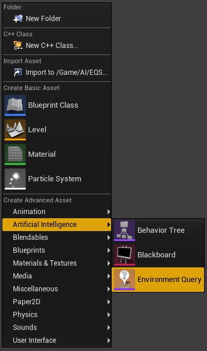

这是内容浏览器中的样子：

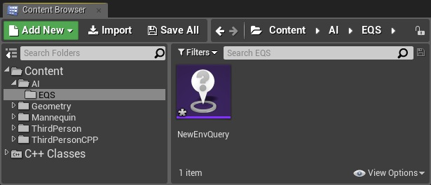

如果我们双击它来打开它，Unreal会打开一个专门的环境查询编辑器。这就是编辑的样子：

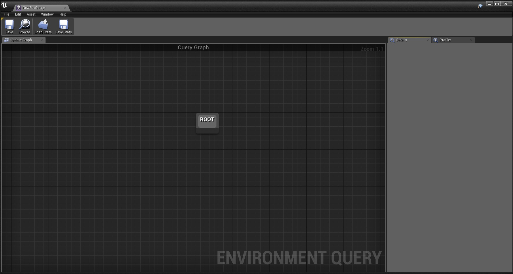

如您所见，它与行为树非常相似，但您只能将生成器节点附加到根节点（仅一个），这也会导致生成叶。因此，整个“树”将只是带有生成器的根节点。实际上，通过使用类似行为树的编辑器，您可以轻松地设置环境查询。在（唯一的）生成器节点上，可以附加生成器本身或上下文中的一个或多个测试。下面是一个例子：

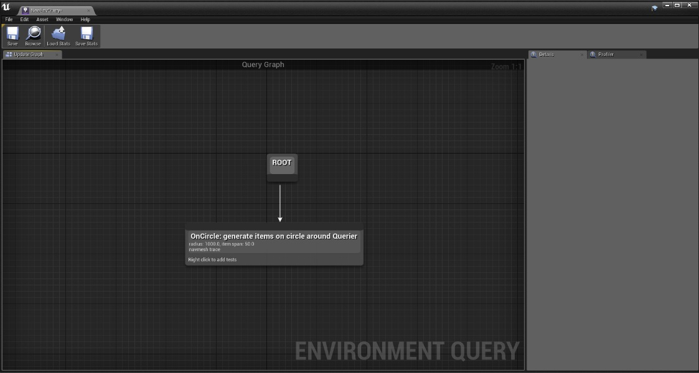

我们将在下一节中理解这意味着什么。

**Contexts**

Contexts是检索信息的特定且方便的类的子类。您可以通过蓝图或使用C++来创建/扩展Contexts。

之所以称它们为Contexts，是因为它们为生成器或测试提供了Contexts。通过有一个Contexts，生成器（或测试）能够从这个点开始执行所有计算。如果您愿意，可以将Contexts视为一个特殊的（非常明确的）变量，它能够在程序上传递一组有趣的Actors和/或位置。

让我们看一个例子，这样我们就清楚什么是Contexts了。在执行测试时，您通常知道查询器（例如，需要保护的代理）的位置（在引擎中，查询器是默认的Contexts）。然而，我们的测试可能需要我们的敌人的位置（例如，检查一个掩护点是否受到攻击，因为这取决于我们特工的敌人的位置）。Contexts可以提供所有这些信息，并且可以以程序的方式这样做：例如，代理可能不知道地图的每个敌人，因此Contexts可能只返回代理当前知道的敌人，因此它只能从这些敌人中找到掩护。因此，如果有一个隐藏的敌人，它选择采取掩护，那么这是我们的代理人的运气不好！

理解Contexts并不容易，所以请坚持本章的内容，当您更好地了解生成器和测试是什么以及如何在项目中构建EQS时，可以在最后重新阅读上一段。

**Generators**

Generators，顾名思义，生成位置（或Actors）的初始集合（或数组）。此集合将通过测试进行筛选和评估。

生成初始化的方法是完全自由的。如果你在评估阶段之前有一些关于你正在寻找的地方的重要信息，那么你可以创建一个自定义生成器（例如，如果代理不能游泳，不要检查有水的地方，或者如果唯一可用的攻击是近战，不要考虑飞敌）。

与上下文一样，生成器也是特定类的子类。您可以在蓝图中创建生成器，也可以在C++中创建生成器。

**Tests**

测试负责对生成器生成的不同位置（或actors）进行筛选和分配分数（评估）。一个测试可以根据相同的标准进行筛选和评分，也可以只根据两个标准中的一个进行筛选和评分。

对于使用过滤的测试，它们会尝试识别哪些位置（或参与者）不适合我们的标准。EQS是优化的，因此它按照特定的顺序执行测试，以便在早期尝试和检测不合适的位置。它这样做是为了不分配一个不会被使用的分数。

一旦所有位置（或actors）都被过滤掉，剩下的位置将被评估。因此，能够分配分数的每个测试在位置（或actor）上被称为（执行）以分数的形式（可以是正的或负的）报告评估。

另外，测试需要（至少）一个上下文来正确地过滤和评估。

让我们看一个简单的测试示例，了解它们是如何工作的。最常见的测试之一是距离，也就是说，这个地方（我们正在评估的生成的）离上下文有多远？上下文可以是Querier，或者它正在攻击的敌人，或者其他任何东西。因此，我们可以（例如）过滤高于或低于某个距离阈值的位置（例如，如果距离玩家太远，我们可能不需要完美的覆盖位置）。同样的距离测试可以根据距离来分配分数，如果上下文是远（或近）的，分数可以是正（或负）。

此外，测试有一个表示测试权重的评分因子：测试有多重要，在计算当前评估位置（或参与者）的最终分数时，该测试需要有多大的影响。实际上，您将在生成器生成的位置上运行许多不同的测试。评分因素允许您轻松地权衡它们，以确定哪个测试对位置（或演员）的最终评分有更高的影响。

每个测试在“详细信息”面板中的选项都具有以下结构：

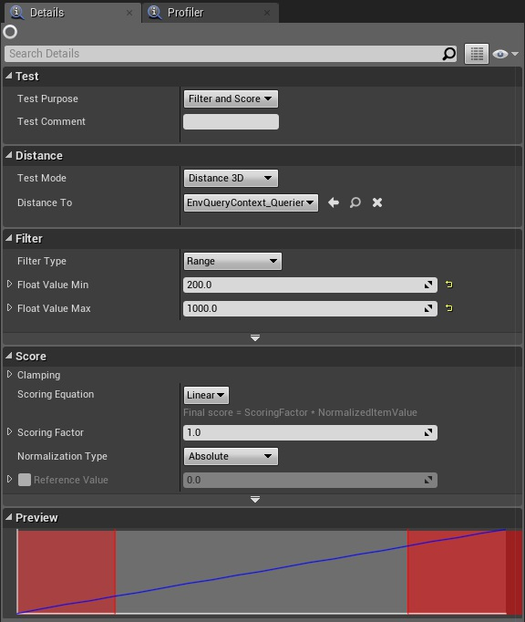

* **Test**：在这里，您可以选择测试的目的是筛选和评分，还是两者中的一个，并添加一个描述（对测试没有影响，但您可以将其视为一个注释来回调此测试的内容）。此外，可能还有其他选项，例如投影数据，可以与导航系统一起使用（对于依赖于导航系统的测试）。
* **Specific Test**：这是进行测试的特定选项的地方。这是不同的测试。
* **Filter**：在这里，您可以选择过滤器的行为方式。这因测试而异，但通常可以选择筛选器类型，如果测试将浮点值作为返回值进行计算，则可以是范围（或最小值或最大值）；否则，对于条件测试，则可以是布尔值。如果测试目的设置为“仅分数”，则不显示此选项卡。
* **Score**：在这里，您可以选择评分的行为方式。这是不同的测试。对于来自测试的浮点返回类型，您可以选择一个用于评分的公式以及一个规范化。此外，还有评分因素，这是这个测试与其他测试相比的权重。对于布尔返回值，只有得分因子。如果测试目的设置为“仅筛选”，则不会显示此选项卡。
* **Preview**：这可以让您预览筛选和评分函数。

如您所见，这些选项非常容易掌握，如果您使用EQS进行练习，您将更好地理解它们。

**组件的可视化表示**

这些组件在一开始可能不是非常直观的，但是一旦你习惯了EQS，你就会意识到它们是如何有意义的，以及为什么系统是这样设计的。

为了总结组件及其重要性，并为您提供可视化表示，下面是一个可供参考的图表：

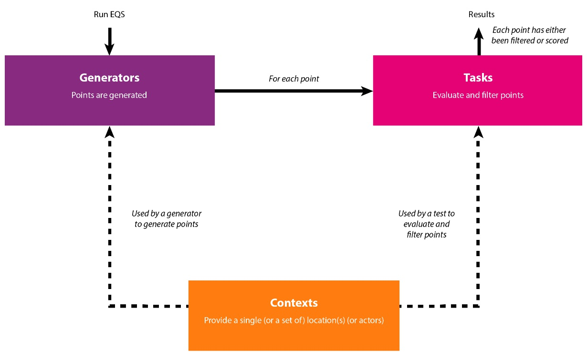

**在行为树中执行环境查询**

最后，要完全理解环境查询是如何工作的，最后一步是查看如何在行为树中运行它。

谢天谢地，我们有一个名为run EQS的节点，这是一个内置的行为树任务。在行为树编辑器中，如下所示：

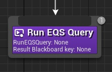

在“详细信息”面板中可以找到以下可能的设置：

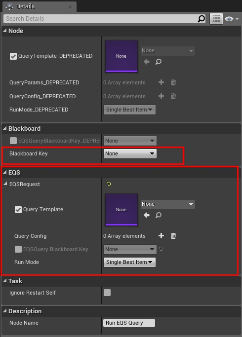

正如您所看到的，许多是不推荐的\(所以忽略它们\)，但是我强调了最重要的那些。以下是对它们的解释:

* **Blackboard Key**：这是引用黑板变量的黑板键选择器，其中将存储EQS的结果。
* **Query Template**：我们要运行的EQS的特定引用。否则，我们可以停用此选项以激活EQSQuery黑板键。
* **Query Config**：这些是查询的可选参数（不幸的是，我们不会在本书中详细讨论它们）。
* **EQSQuery Blackboard Key**：一种黑板键选择器，它引用一个包含EQS的黑板变量。如果激活，将执行黑板变量中包含的EQSQuery，而不是查询模板。
* **Run Mode**：这显示了我们要检索的查询的结果。可能的选择如下：
  * **Single Best Item**：这将检索得分最高的点（或actor）
  * **Single Random Item from Best 5%**：这将在5%的最佳评分位置（或actor）中检索一个随机点
  * **Single Random Item from Best 25%**：这将在25%的最佳评分位置（或actor）中检索一个随机点
  * **All Matching**：这将检索与查询匹配的所有位置（或actor）（它们尚未被筛选出）

这就总结了我们如何运行一个EQS并检索它的结果，以便可以在行为树中使用它。

#### 不只有Location，还有Actors

当我说“评估一个地点（或演员）……”时，我强调了很多。

事实上，EQs最酷的特性之一是不仅可以评估地点，还可以评估Actors！

同样，您可以使用EQS作为决策过程。想象一下，你需要先选择一个敌人进行攻击。你可能需要考虑各种因素，比如敌人的剩余生命，它有多强大，以及在不久的将来它被视为威胁的程度。

通过仔细设置一个EQS，你可以给每一个敌人分配一个分数，这取决于哪一个是最容易攻击的。当然，在这种情况下，您可能需要花一点时间来创建适当的生成器，以及上下文和适当的测试，但从长远来看，当代理需要做出此类决策时，它使EQS成为一个非常好的选择。

### 探索内置的节点

在我们创建自己的生成器、上下文和测试之前，让我们先讨论一下内置节点。Unreal附带了一些有用的内置通用节点。我们将在本节中探讨它们。

#### Built-in Contexts

既然我们开始通过上下文来解释EQS，那么让我们从内置上下文开始。当然，创造通用语境几乎是一个悖论，因为语境对“语境”（情境）非常特殊。

然而，Unreal有两个内置的上下文:

* **EnvQueryContext\_Querier**：这表示请求查询的Pawn（确切地说，不是Pawn请求查询，而是运行请求查询的行为树的控制器，并且此上下文返回受控制的Pawn）。因此，通过使用这个上下文，一切都将相对于查询器。
* **EnvQueryContext\_Item**：这将返回生成器生成的所有位置。

#### Built-in Generators

有很多内置的生成器，而且大多数时候，这些都足够你做大多数你想要的EQS。只有当您有特定的需要，或者您想优化EQS时，才可以使用自定义生成器。

大多数生成器都是直观的，因此我将简要地解释它们，并提供（必要时）一个屏幕截图，显示它们生成的点的类型。

这是可用的内置生成器列表，您可以在环境查询编辑器中找到它们：

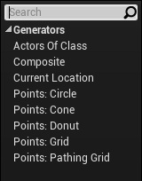

为了组织这些信息，我将把每个生成器分成一个小节，并按照前面屏幕截图中列出的顺序（按字母顺序）对它们进行排序。

**Actors Of Class**

此生成器接受特定类的所有参与者，并将其所有位置作为生成点返回（如果这些参与者位于上下文的某个半径内）。

这是环境查询编辑器中的外观：

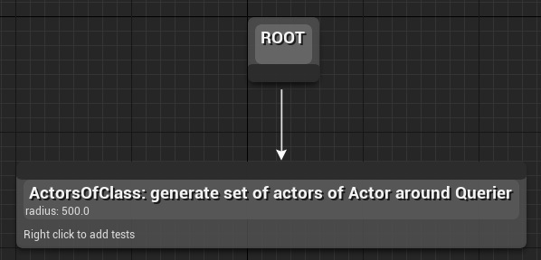

可能的选项是Searched Actor类（显然）和搜索中心的搜索半径（表示为上下文）。或者，我们可以检索某个类的所有参与者，并忽略它们是否在搜索半径内：

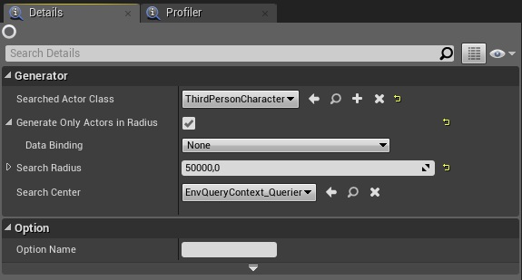

在前面的截图中，我使用queryer作为搜索中心，搜索半径为50000，使用ThirdPersonCharacter作为搜索的Actor类，因为它已经在项目中可用。

通过使用这些设置（并放置几个第三个角色actors），我们有以下情况：

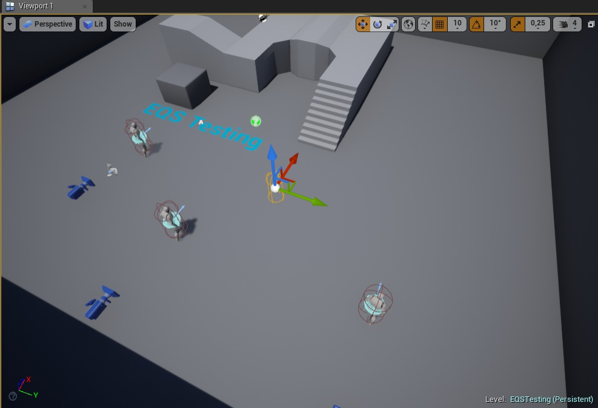

注意围绕着三个ThirdPersonCharacter actors的\(蓝色\)球体。

**Current Location**

当前位置生成器只需从上下文中检索位置并使用它（或它们）生成点。

这是环境查询编辑器中的外观：

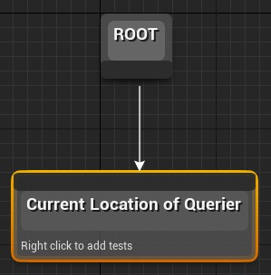

此生成器唯一可用的设置是查询上下文：

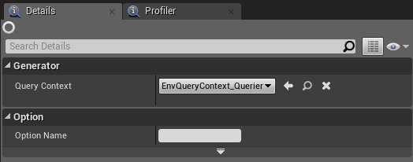

因此，如果我们使用查询器作为查询上下文，那么我们只需要查询器本身的位置，如下面的屏幕截图所示：

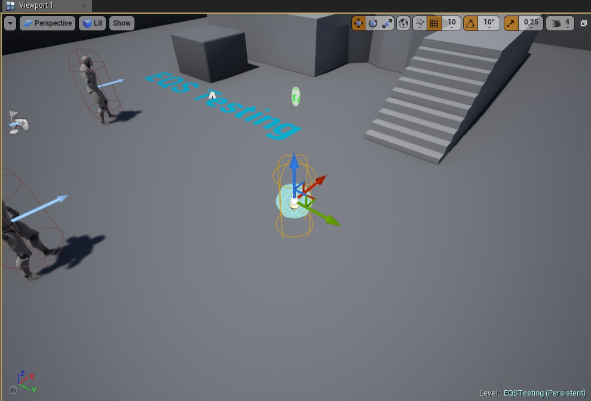

**Composite**

复合生成器允许您混合多个生成器，以便可以有更多的点选择。

这是环境查询编辑器中的外观：

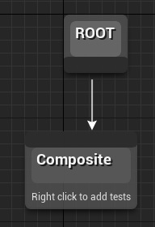

在“设置”中，可以设置生成器数组：

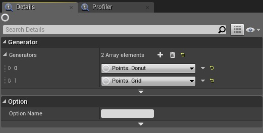

因为我们没有时间详细讨论每件事，所以我就不再讨论这个生成器了。

**Points: Circle**

顾名思义，圆生成器围绕指定半径的圆生成点。此外，还提供了与Navmesh交互的选项（这样就不会在Navmesh之外生成点）。

这是环境查询编辑器中的外观：

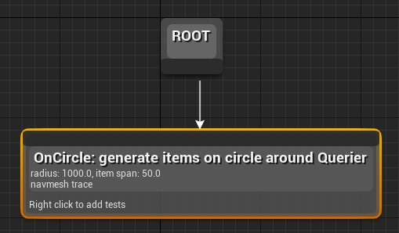

这是一个非常复杂的生成器，因此该生成器有各种设置。让我们看看：

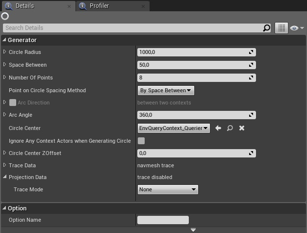

* **Circle Radius**：顾名思义，它就是圆的半径。
* **Space Between**：每个点之间应该有多少空间；如果圆上的点间距方法设置为“按间距”。
* **Number of Points**：应生成多少个点；如果圆上的点间距方法设置为“按点数”。
* **Point On Circle Spacing Method**：确定要生成的点数是否应基于固定点数（按点数）计算，或者如果点数之间的间距固定（按间距），则应根据符合当前圆的点数计算。
* **Arc Direction**：如果我们只生成圆的一个弧，这个设置决定了它应该在的方向。计算方向的方法可以是两点（它接受两个上下文并计算两个上下文之间的方向）或旋转（它接受一个上下文并检索其旋转，并基于该旋转确定弧的方向）。
* **Arc Angle**：如果这与360不同，它将定义停止生成点的切割角度，从而创建圆弧而不是圆。此圆弧的方向（或旋转）由“圆弧方向”参数控制。
* **Circle Center**：顾名思义，它是圆的中心，用上下文表示。
* **Ignore Any Context Actor when Generating Circle**：如果选中，它将不考虑用作圆上下文的参与者，因此跳过以在这些位置生成点。
* **Circle Center Z Offset**：顾名思义，它是圆中心沿z轴的偏移。
* **Trace Data**：生成圆时，如果有障碍物，通常我们不想生成障碍物后面的点。此参数确定执行“水平”跟踪的规则。这些选项如下：
  * **None**：没有轨迹，所有生成的点都在圆（或弧）上。
  * **Navigation**：这是默认选项。NavMesh端点是生成点的位置，即使距中心的距离小于半径（在某种程度上，如果遇到NavMesh的边界，圆将采用NavMesh的形状）。
  * **Geometry**：与导航相同，但不使用NavMesh作为边界，跟踪将使用级别的几何体（如果没有NavMesh，这可能非常有用）。
  * **Navigation Over Ledges**：与导航相同，但现在的跟踪是“over ledges”。
* **Projection Data**：这与跟踪数据类似，但通过从上方投影点来执行“垂直”跟踪。对于其余部分，其概念与跟踪数据完全相同。选项有None、Navigation和Geometry，它们在跟踪数据中的含义相同。“在窗台上导航”不存在，因为它没有任何意义。

通过使用前面屏幕截图中显示的相同设置（我将跟踪数据与导航一起使用，并且在级别中有一个NavMesh），这就是它的外观（我使用P键激活了NavMesh，这样您也可以看到）：

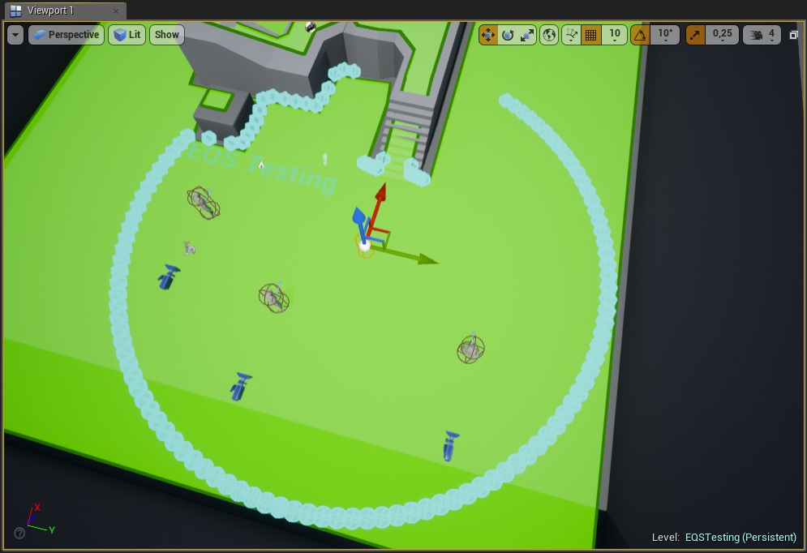

通过对跟踪数据使用几何图形，我们获得了非常相似但略有不同的形状：

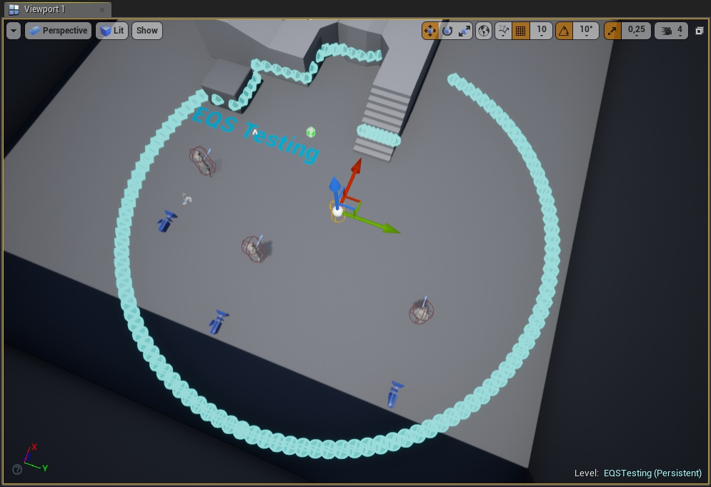

**Points: Cone**

顾名思义，圆锥体生成器在特定上下文（如聚光灯）的圆锥体中生成点。此外，还提供了与Navmesh交互的选项（以便可以将点投影到Navmesh上）。

重要的是要知道它的形状是由许多圆产生的，我们总是从这些圆上画出相同的弧。所以，如果我们取整个圆，我们基本上是在一个切片的区域生成点。

这是环境查询编辑器中的样子：

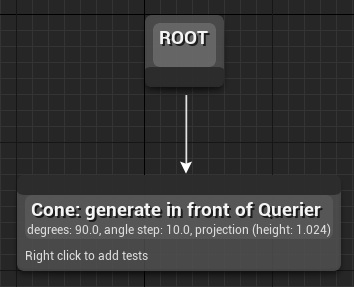

它的设置主要与圆锥体的形状有关，因此让我们来探索它们：

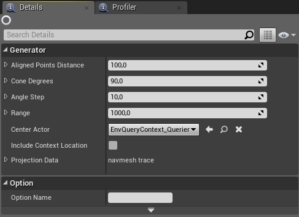

* **Aligned Points Distance**：这是生成点的每个弧之间的距离（与中心成相同角度的点之间的距离）。值越小，生成的点越多，所考虑的区域将越密集。
* **Cone Degrees**：这决定了每个圆的弧度有多大（我们正在考虑切片有多宽）。值360会将圆的整个区域考虑在内。
* **Angle Step**：这是同一圆弧点之间的距离，用度数表示。较小的值意味着更多的点，所考虑的区域将更密集。
* **Range**：这决定了圆锥体可以有多远（以聚光灯为例，它可以照亮多远）。
* **Center Actor**：这是生成的圆的中心，用于确定圆锥体。它是中心，并且被表达为一个上下文。
* **Include Context Location**：顾名思义，如果选中，圆锥体/圆的中心也将生成一个点。
* **Projection Data**：通过考虑几何体或导航网格从上方投影点，执行“垂直”跟踪。实际上，可能的选项有无、导航和几何图形。

通过使用默认设置，这就是圆锥体在关卡中的外观：

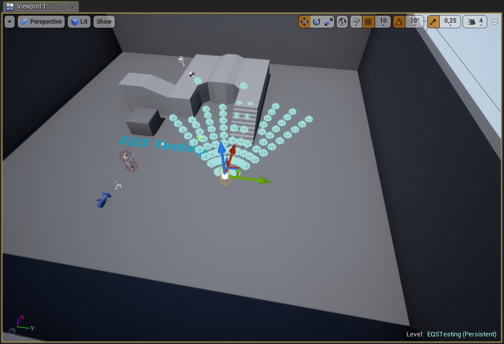

**Points: Donut**

顾名思义，甜甜圈生成器生成甜甜圈形状的点（或“环”，为你们这些数学爱好者），从作为上下文给定的特定中心开始。此外，还提供了各种选项，以便可以与Navmesh交互（以便可以将点投影到Navmesh上）。

这是环境查询编辑器中的外观：

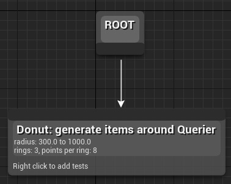

以下设置可用：

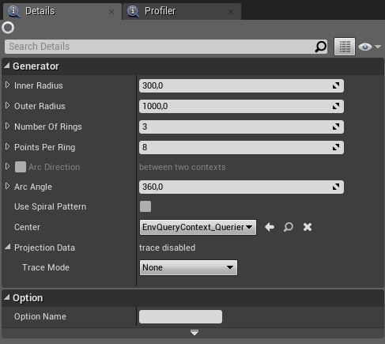

* **Inner Radius**：这是甜甜圈“洞”的半径；在该半径内不会生成任何点（因此从中心看，它与该值不接近）。
* **Outer Radius**：这是整个甜甜圈的半径；点将在内半径和外半径之间的环中生成。这也意味着，在该半径之外将不会生成任何点（因此，从中心到该值更远）。
* **Number of Rings**：内半径和外半径之间应生成多少个点环。这些环的间距总是相等的，这意味着它们的距离是由这个变量控制的，还有内半径和外半径。
* **Points per Ring**：这决定了每个生成的环应该有多少个点。这些点沿环均匀分布。
* **Arc Direction**：如果我们只生成一个圆环的弧线（准确地说，只有一个圆的弧线会生成圆环），那么这个设置决定了它应该在的方向。计算方向的方法可以是两点（它接受两个上下文并计算两个上下文之间的方向）或旋转（它接受一个上下文并检索其旋转，并基于该旋转确定弧的方向）。
* **Arc Angle**：如果这不是360度，它将定义停止生成点的切割角度，从而创建圆弧而不是圆。此圆弧的方向（或旋转）由“圆弧方向”参数控制。
* **Use Spiral Pattern**：如果选中此选项，则每个环中的点将稍微偏移以生成螺旋图案。
* **Center**：这是生成环的中心（以及分别用内半径和外半径指定的圆环的最小和最大延伸）。它被表达为一个上下文。
* **Projection Data**：这通过考虑几何体或导航网格从上方投影点来执行“垂直”跟踪。可能的选项有无、导航和几何图形。

要了解这些设置，请查看以下屏幕截图：

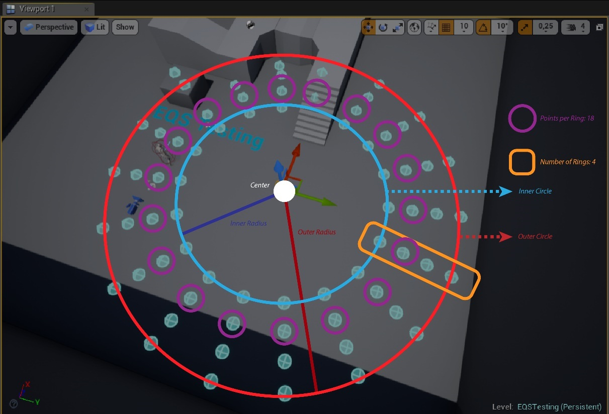

通过使用这些稍微修改过的设置（请注意我是如何增加内半径的，增加了每个环和点的数量，还使用了投影数据导航），可以轻松地可视化甜甜圈。以下是我使用的设置：

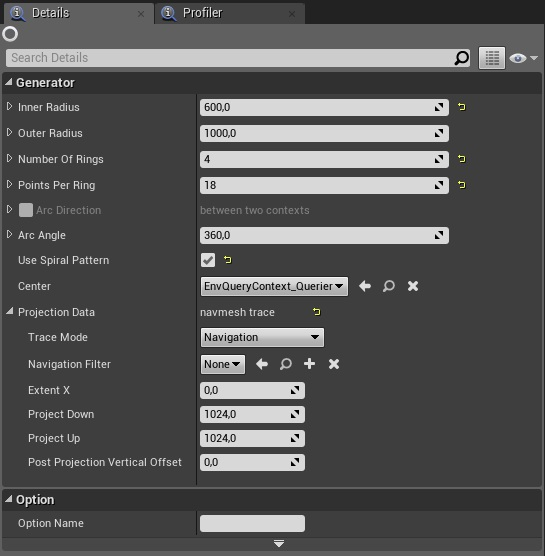

这就是他们产生的结果：

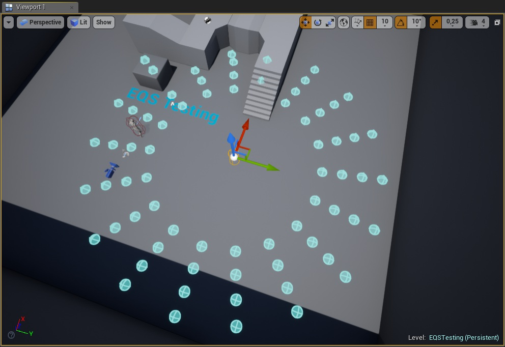

通过使用相同的设置，并选中“使用螺旋图案”，可以看到不同环中的点如何稍微偏移，从而创建螺旋图案：

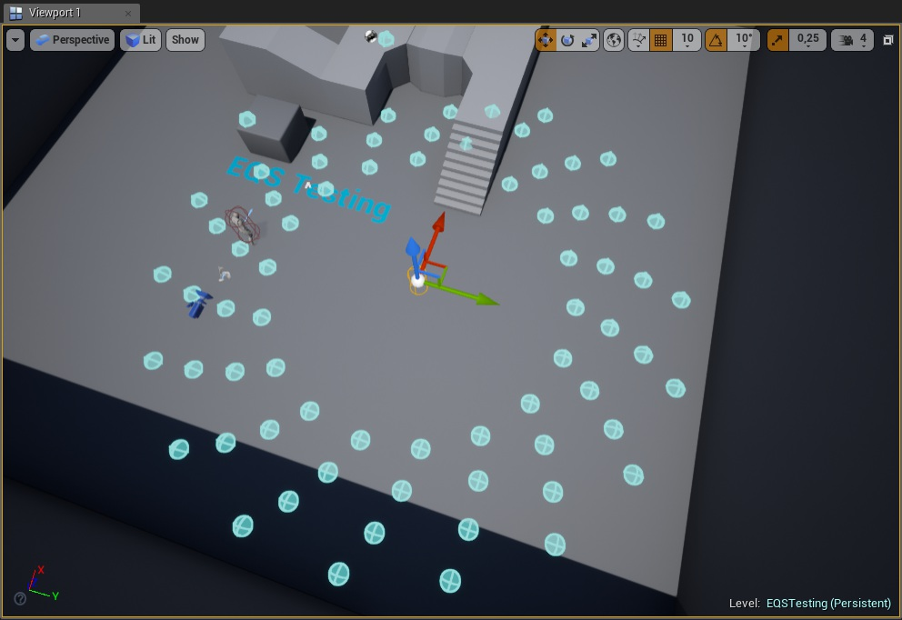

**Points: Grid**

顾名思义，栅格生成器生成栅格中的点。此外，还提供了与Navmesh交互的选项（这样就不会在Navmesh之外生成点）。

这是环境查询编辑器中的外观：

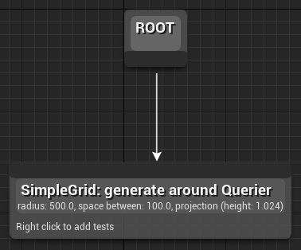

此生成器的设置非常简单：

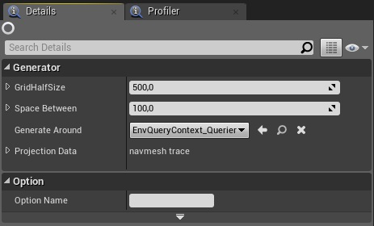

* **GridHalfSize**：网格应该从其中心延伸多少（这意味着它是整个网格大小的一半）。网格的尺寸完全由这个参数决定，以及两者之间的间距。
* **Space Between**：网格的每行和每列之间有多少空间。网格的尺寸完全由这个参数和GridHalfSize决定。
* **Generate Around**：这是网格的中心（开始生成网格的地方），它被表示为一个上下文。
* **Projection Data**：这通过从上方投影点来执行“垂直”跟踪。它通过考虑几何体或导航网格来实现这一点。可能的选项有无、导航和几何图形。

通过查看设置，您可以看到这个生成器非常简单，但功能强大，而且非常常用。在默认设置下，这是它在级别中的外观（投影在Navmesh中启用，并显示在地图中）：

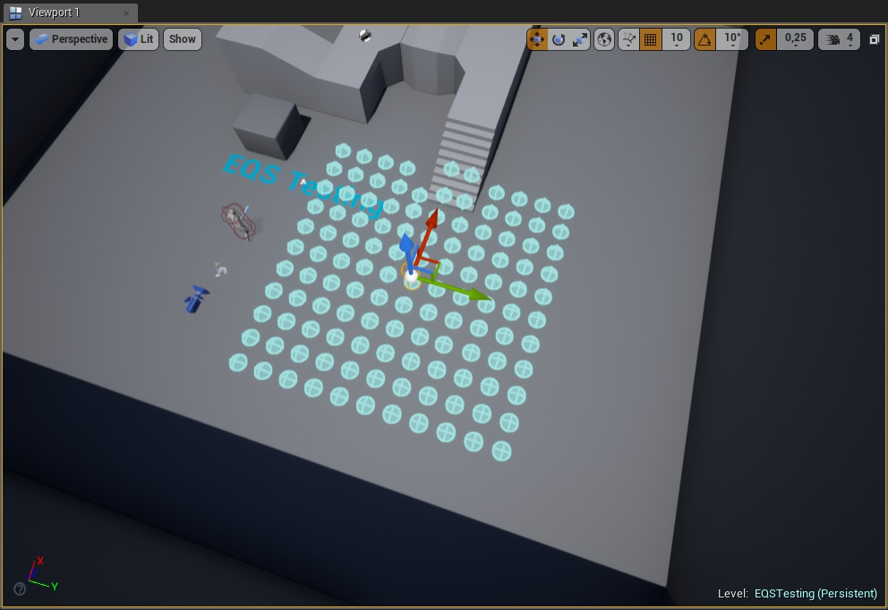

**Points: Pathing Grid**

顾名思义，路径栅格生成器在栅格中生成点，就像栅格生成器一样。但是，此生成器的区别在于，路径栅格生成器检查在指定距离内，是否可以通过“围绕生成”设置（通常是查询器）中指定的上下文访问这些点。

这是环境查询编辑器中的外观：

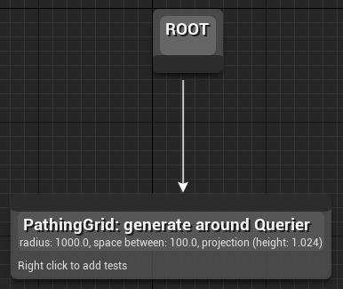

此生成器的设置几乎与点相同：栅格生成器：

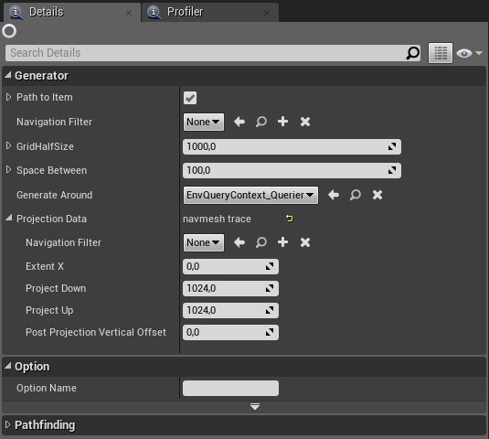

* **Path to Item**：如果选中此选项，则会在查询器的设置中排除无法从上下文访问的所有点。
* **Navigation Filter**：顾名思义，它是用来执行路径查找的导航过滤器。
* **GridHalfSize**：网格应该从其中心延伸多少（这意味着它是整个网格大小的一半）。网格的尺寸完全由这个参数决定，以及两者之间的间距。
* **Space Between**：网格的每行和每列之间有多少空间。网格的尺寸完全由这个参数和GridHalfSize决定。
* **Generate Around**：这是网格的中心（开始生成网格的地方），它被表示为一个上下文。
* **Projection Data**：这通过从上方投影点来执行“垂直”跟踪。它通过考虑几何体或导航网格来实现这一点。可能的选项有无、导航和几何图形。

这就是它在环境中的样子（我稍微改变了一下高度，挡住了楼上的路）。这清楚地表明，楼梯后面那些无法到达的点甚至都不是由该生成器生成的）：

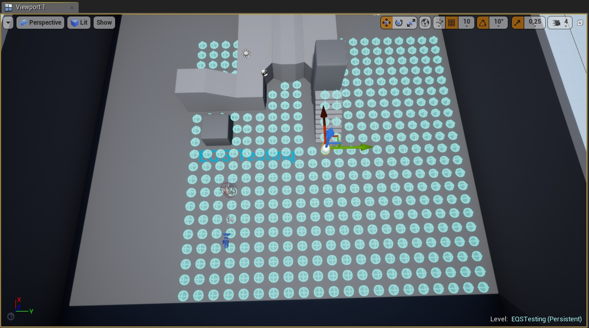

#### 构建测试

既然我们已经探索了所有的生成器，现在是时候探索引擎中可用的不同测试了。通常，返回值可以是布尔值或浮点值。

返回浮点值的测试最常用于评分，而返回布尔值的测试更常用于筛选。但是，每个测试可能有不同的返回值，这取决于该测试是否用于筛选或评分。

这是可能的内置测试列表；让我们来探索它们：

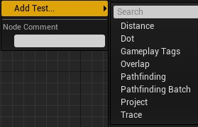

* **Distance**：计算项目（生成的点）与特定上下文（例如查询器）之间的距离。它可以在三维、二维、沿日轴或沿z轴（绝对）计算。返回值是一个浮点数。
* **Dot**：计算行A和行B之间的点积。这两行可以表示为两个上下文之间的行，也可以表示为特定上下文的旋转（通过获取旋转的正向）。计算可以在3D或2D中进行。
* **Gameplay Tags**：对游戏标签执行查询。
* **Overlap**：使用方框执行重叠测试；可以指定某些选项，例如偏移或延伸或重叠通道。
* **Pathfinding**：在正在计算的生成点和上下文之间执行路径查找。特别是，我们可以指定返回值是布尔值（如果路径存在）还是浮点值（路径开销甚至路径长度）。此外，可以指定路径是从上下文到该点，还是相反，并且可以使用导航滤波。
* **Pathfinding Batch**：与寻路相同，但是成批的。
* **Project**：执行可通过不同参数自定义的投影。
* **Trace**：执行跟踪测试，所有可能的选项都可用于在引擎中的其他位置执行跟踪。这意味着它可以跟踪一条线、一个框、一个球体或一个胶囊；可以在可见性或摄影机跟踪通道上；可以是复杂的，也可以是简单的；可以是从上下文到点，或者是相反。

我们对内置节点的探索到此结束。

### 可视化环境查询

如前所述，有一种简单的内置方式可以直接从视窗中可视化游戏世界中的环境查询；游戏甚至不必运行。事实上，有一个特别的棋子，它能够做到这一点。但是，这个Pawn不能直接带到这个级别，因为为了确保它没有被误用，它在代码库中被声明为虚拟的。这意味着要使用它，我们需要创建自己的蓝图Pawn，直接从这个特殊的Pawn继承。

谢天谢地，在这一步之后，典当的功能就完全实现了，它不需要更多的代码，只需要使用参数（即您想要可视化的环境查询）。

首先，创建一个新的蓝图。要继承的类是EQSTestingPawn，如下图所示：

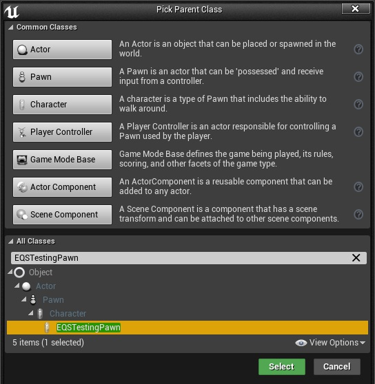

然后，可以将其重命名为myeqstestingpown。

如果将其拖到地图中，则可以从“详细信息”面板更改EQS设置，如以下屏幕截图所示：

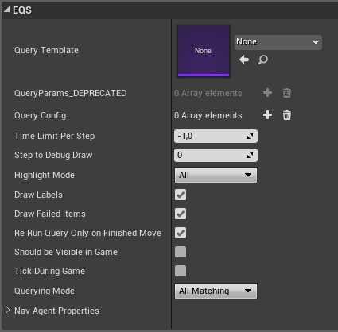

最重要的参数是查询模板，您可以在其中指定要可视化的查询。如果您想要对参数进行深入的分解，请参阅第12章，AI的调试方法-导航、EQS和分析。

### 为环境查询系统创建组件

在本节中，我们将了解需要扩展哪个类以在环境查询系统中创建自定义组件。

#### 创建Contexts

创建自定义上下文是在环境查询过程中需要引用时获得正确引用的关键。特别是，我们将创建一个简单的上下文来检索对Player的单个引用。

让我们来探讨如何在C++和蓝图中创建这个上下文。

**在蓝图中创建Player Context**

要创建上下文，我们需要从EnvQueryContext\_BlueprintBase类继承。对于蓝图，在创建时，只需选择突出显示的类，如下面的屏幕截图所示：

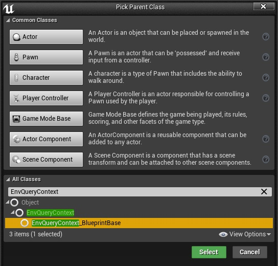

至于名称，约定是保留前缀“EnvQueryContext”。我们可以将上下文称为“EnvQueryContext\_BPPlayer”。

对于蓝图上下文，可以选择实现以下功能之一：

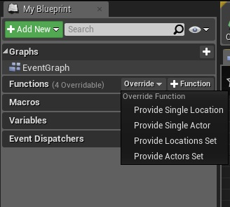

每个都将为环境查询提供一个上下文。

我们可以重写Provide Single Actor函数，然后返回Player Pawn，简单如下：

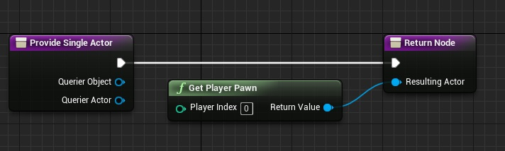

因此，我们现在有了一个上下文，它可以获取玩家引用。

**在C++中创建Player Context**

在创建C++上下文的情况下，从EnvQueEnrices类继承，如下面的截图所示：

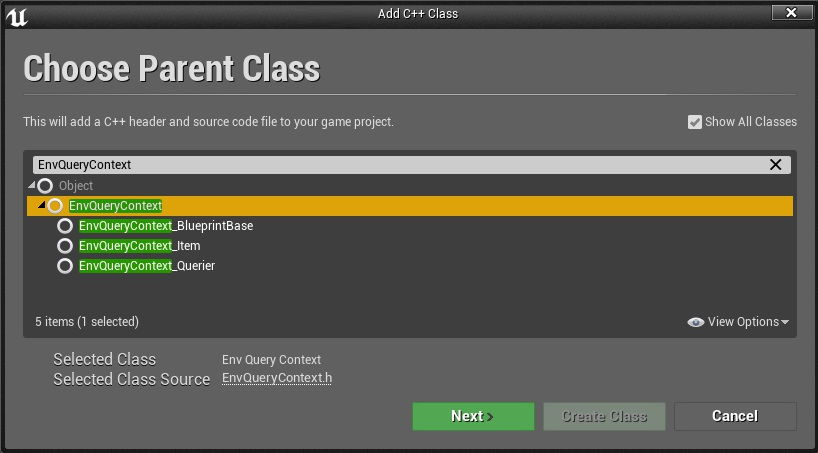

约定是相同的，即在上下文前面加上“EnvQueryContext”。我们将我们的类称为“EnvQueryContext\_Player”：

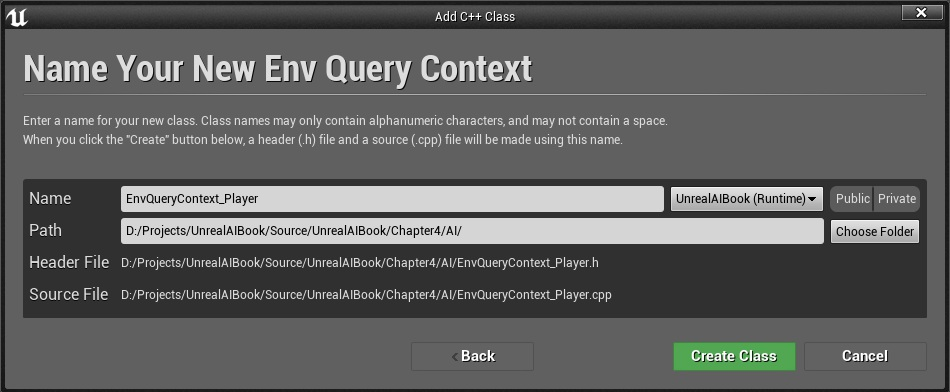

在C++中，只有一个函数可以重写：PosivEngType\(\)。因此，我们只需要在.h文件中重写它，如下所示：

```cpp
#include "CoreMinimal.h"
#include "EnvironmentQuery/EnvQueryContext.h"
#include "EnvQueryContext_Player.generated.h"
/**
 * 
 */
UCLASS()
class UNREALAIBOOK_API UEnvQueryContext_Player : public UEnvQueryContext
{
  GENERATED_BODY()

  virtual void ProvideContext(FEnvQueryInstance& QueryInstance, FEnvQueryContextData& ContextData) const override;
};
```

在实现文件中，我们可以提供上下文。我不打算详细介绍如何阅读其他上下文的代码来帮助您理解这一点。在任何情况下，对于.cpp文件，我们都可以有如下内容（我可以以不同的方式实现，但我选择这样做是因为我认为它很容易理解）：

```cpp
#include "EnvQueryContext_Player.h"
#include "EnvironmentQuery/EnvQueryTypes.h"
#include "EnvironmentQuery/Items/EnvQueryItemType_Actor.h"
#include "Runtime/Engine/Classes/Kismet/GameplayStatics.h"
#include "Runtime/Engine/Classes/Engine/World.h"

void UEnvQueryContext_Player::ProvideContext(FEnvQueryInstance& QueryInstance, FEnvQueryContextData& ContextData) const
{
  if (GetWorld()) {
    if (GetWorld()->GetFirstPlayerController()) {
      if (GetWorld()->GetFirstPlayerController()->GetPawn()) {
        UEnvQueryItemType_Actor::SetContextHelper(ContextData, GetWorld()->GetFirstPlayerController()->GetPawn());
      }
    }
  }
}
```

因此，我们能够在C++中检索玩家上下文。

#### 创建生成器

与我们创建上下文的方式类似，我们可以创建自定义生成器。但是，我们不会详细讨论这个问题，因为它们不在本书的讨论范围之内。

对于Blueprint，从EnvQueryGenerator\_BlueprintBase类继承，如以下屏幕截图所示：

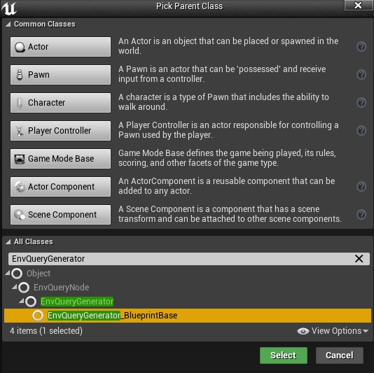

在C++中，需要从EnvQueryGenerator继承：

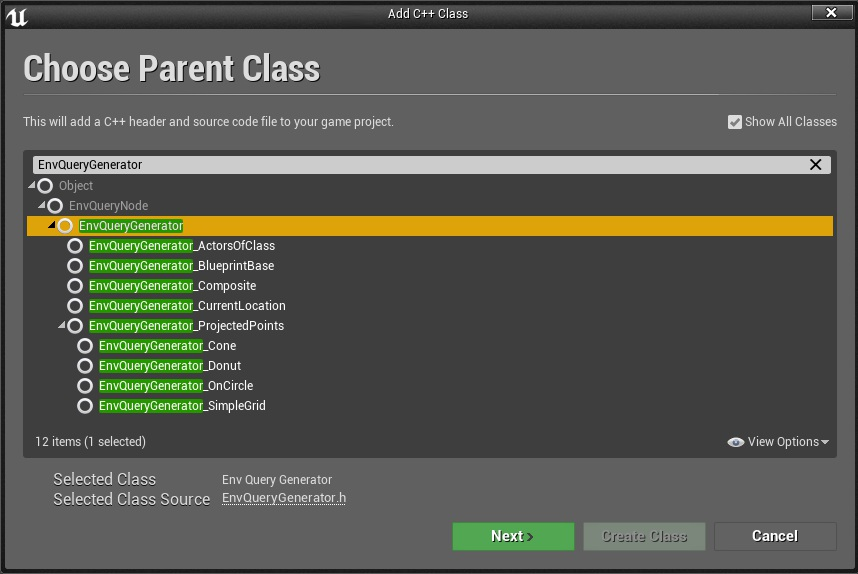

#### 创建Tests

在当前版本的虚幻引擎中，不可能在蓝图中创建一个测试——我们只能用C++来实现。可以通过扩展EnvQueryTest类来执行此操作：

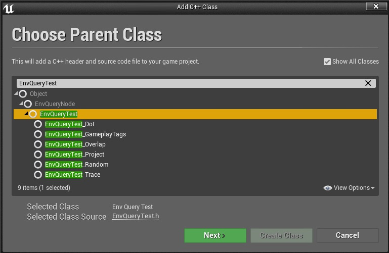

不幸的是，这也超出了本书的范围。然而，探索虚幻引擎源代码会给你提供大量的信息和几乎无限的学习资源。

### 总结

本章探讨了环境查询系统如何在决策领域进行空间推理。

特别是，我们了解了整个系统的总体工作原理，然后我们查看了系统的内置节点。我们还看到了如何使用一个特殊的棋子来可视化查询。最后，我们探讨了如何扩展该系统。

在下一章中，我们将探讨代理感知和内置感知系统。

